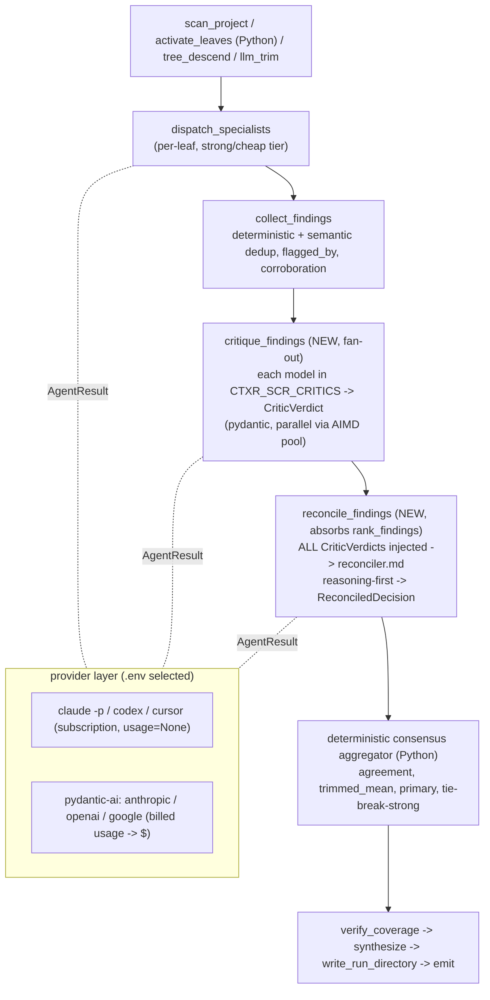
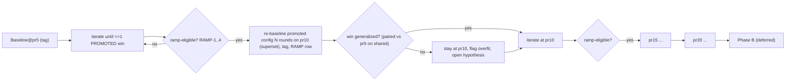
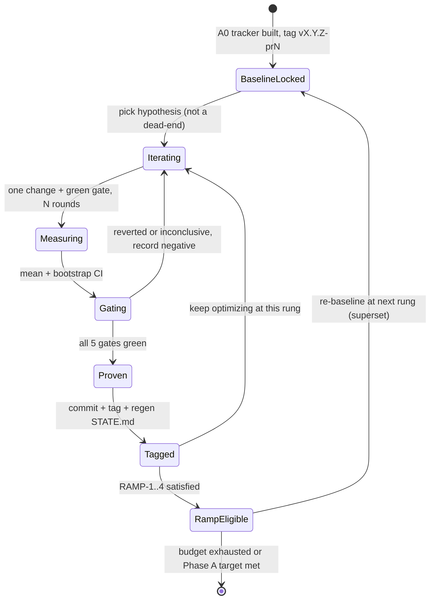

# skill-code-review: Master Plan to Top the Martian Code Review Bench

Status: IN PROGRESS (canonical, checkbox-tracked). This file is the single source of truth for
the benchmark-optimization program. A0 (proof machine), A1 (Baseline@pr5 locked), the timing
telemetry, and L1 (whole-word activation matcher, a recall-safe precision fix, `01275c0`) are DONE
(section 9 checkboxes). The routing/leaf-navigation SPEED levers ran as two gated rounds and the
structural approaches are PROVEN DEAD-ENDS (S1 merge, L2 chunk) or no-benefit (S2 de-glob), each
caught cheaply before any N=3 spend; routing-speed reduction is DEFERRED (routing is decode-bound,
not input-bound; section 5A). The live program now pursues TWO woven goals:
keep HIGH-QUALITY reviews (no recall or F1 loss) AND DECREASE latency, every speed change held to
the same F1 5-gate predicate that the quality changes are. This is the in-repo canonical doc.

North star (one sentence, governs every sequencing call below): drive review wall-time DOWN while
holding review QUALITY flat or up, by gating every speed experiment on the exact same 5-gate
predicate (section 6.3), so speed can never trade away recall.

---

## 0. HOW TO USE AND RESUME THIS DOCUMENT (read this first)

This plan is written to be continued cold from any new dialog after a context reset. If you
are resuming:

1. Read this file top to bottom once. It contains every locked decision, the methodology, the
   architecture, the schemas, the gate predicates, the phase checklist, the file anchors, the
   deps, and the verification commands. Note the program now carries a first-class LATENCY /
   SPEED workstream (section 5A and phases S1, S2, S3) woven into the F1 plan; speed and quality
   are pursued together, never traded off.
2. Find "where we are" from the **generated state surface**, never from memory:
   - `skill-code-review/benchmarks/STATE.md` (generated; the live "YOU ARE HERE").
   - `uv run python benchmarks/experiments.py status` (one-line current position).
   - The phase checkboxes in section 9 of this file (A0, A1, and timing telemetry are DONE).
3. Read the ground-truth skill `skill-code-review/.agents/skills/scr-benchmark-optimizer/SKILL.md`
   (the measure-judge-diagnose-improve loop, the levers, the no-regression gate, the hard-won
   lessons) and `tmp/OBSERVATIONS.md` (what has already been tried). For any change that touches
   the reviewer corpus or activation (the S2 broad-activation cut is one), the wiki-build change
   protocol is MANDATORY: read section 6.9 here AND
   `.agents/skills/scr-reviewers-wiki-authoring/SKILL.md`.
4. Never skip the gate. Every change, QUALITY or SPEED, is proven by the 5-gate predicate
   (section 6.3) over N rounds before it is promoted and tagged. A speed change additionally
   passes the cheap-first wall-time check (one instrumented review confirming the latency drop and
   a leaf-set sanity check) BEFORE the full F1 measurement is spent. The PR count only grows after
   a proven, tagged win (section 6.6).
5. House rules that always apply: no em or en dashes in authored text; prompts live in
   `code_review/workers/*.md` (never hardcoded in Python); mutating scripts dry-run unless
   `--apply`; `ruff` + `mypy` + `pytest` green before any commit; reviewers.wiki SET or
   STRUCTURE changes (and any activation/glob narrowing) stay human-gated and follow the section
   6.9 protocol; drive reviews only through the product runner; every speed change is F1-5-gated
   and may never regress recall.

---

## 1. CONTEXT (why this exists)

We want `skill-code-review` to be measurably #1 (or clearly top-tier) on Martian's open
**offline-50** code-review benchmark, then earn a durable, statistically defensible product
claim. A three-agent investigation (code reality, harness and optimization history, external
competitive reality) plus three design agents (methodology, architecture, calibration and
stats) produced this plan.

The reality anchor: **we have never run our own full 50.** Every self-measured number we own is
the 5-PR pilot, which our own benchmark skill flags as a cubic-favorable slice. The "0.62 bar"
is the competitors' number read off the committed Martian evals, not ours. Our full-50 F1 is
unknown, and we reach it gradually (5, 10, 15, 20 ...), never in one budget-busting run.

The user's stated fear, which the methodology in section 6 exists to kill: "we will do too
much in one round, then start running on a big amount of PRs and get lost somewhere in the
middle without knowing where we are or what to do next... move forward to more PRs only with
proof that our enhancements actually made it better, so we do not dig into a rabbit hole and
then into chaos development."

---

## 2. LOCKED DECISIONS (the grilled decision tree)

| Branch | Decision |
|---|---|
| Goal | Both, sequenced. Phase A tops the offline board with lean programmatic rigor; Phase B (the durable statistical product claim) is deferred behind an explicit go/no-go. |
| PR ramp | Gradual and budget-bound: lock a baseline at 5 PRs, then 10, 15, 20 ... Each rung is re-baselined and tagged. Never the full 50 in one run. |
| Tracker | A committed SQLite DB (`benchmarks/experiments.db`) plus a query CLI, with an auto-generated markdown view (`benchmarks/HISTORY.md`, `LEADERBOARD.md`, `STATE.md`) so a `git diff` still shows the leaderboard in plain text. Records config, PR set, metrics with bootstrap CIs, fp/PR, and dollars/review. `vX.Y.Z`-style tags freeze references. |
| Baseline and noise | The 5-PR signal is noise-bound (ranker is stochastic, F1 swings +/-0.05 to 0.10). Lock the baseline as the mean of N rounds with a bootstrap CI, re-judge the baseline under the identical rubric (paired), and require every change to clear the baseline CI, not its point estimate. |
| Provider layer | Use existing libraries: **PydanticAI** behind the existing `AgentRun` seam, backend and model selected by `.env` (python-dotenv), so CLI vs API vs provider are head-to-head comparable. Capture billed usage to dollars. Add the missing Gemini backend. Pin model snapshots. No OpenRouter. |
| Primary lever | A finding-level **verification/critic pass + reasoning-first** (reasoning ordered before the verdict), after diagnosing why the product runner under-realizes the offline-harness precision it already proves achievable. |
| Multi-model (hard requirement) | All critics and all models produce **pydantic-typed** outputs, and **all model outputs are always injected into the reconciliation prompt** (consensus raises confidence and determinism). Multi-model is core and always-on by design, not a cost-gated afterthought. The number of PRs (not disabling consensus) is the cost throttle while developing. |
| Calibration (hard requirement) | The confidence/threshold calibration is a durable, re-runnable, idempotent `scripts/calibrate.py` that fits with scikit-learn, persists a versioned artifact, and the product consumes the artifact at review time. Safe to run periodically as labels accumulate. |
| Stats | Programmatic-only now: bootstrap CIs, paired McNemar and permutation tests, cost tracking, multiple-comparison discipline, a contamination caveat. Defer the 200+ PR multi-rater internal set, Krippendorff ordinal alpha, and formal splits to Phase B. |

---

## 3. CORRECTED COMPETITIVE FACTS (fix these in the canonical doc)

- The **online track is live and Martian-ranked today**, not "post-launch aspirational." The
  offline-50 is the self-runnable track; the online track is real and operational (Martian v0
  post). Read the live (JavaScript-rendered) board for the current #1.
- The **verification/merge pass is Qodo's architecture, not cubic's.** cubic's credited levers
  are micro-agents + reasoning-first + toolset minimization (51% fewer false positives). Do not
  mis-attribute.
- The **current bar is ~0.64** (Qodo Extended, offline, Mar 15 snapshot, F1 0.643), not 0.62
  (cubic 0.618, Mar 25). These are vendor self-published snapshots drifting +0.02 to 0.03 per
  monthly refresh. Martian's stated recall ceiling: "no tool found more than 63% of known
  issues."
- The **judge is a 3-model panel** (Claude Opus 4.5, Claude Sonnet 4.5, GPT-5.2), not one
  pinned judge.
- **Gold-set bias and contamination:** the offline gold set was seeded from Augment/Greptile
  data, so a real bug outside the gold set scores as a false positive, and the 5 public repos
  may be memorized by the models. Treat the offline number as comparative, not absolute. Phase
  B's private set is what neutralizes this.

References: Martian benchmark (codereview.withmartian.com, github.com/withmartian/code-review-benchmark, MIT),
Martian v0 post (withmartian.com/post/code-review-bench-v0), cubic (cubic.dev/blog/learnings-from-building-ai-agents),
Qodo (qodo.ai/blog/qodo-ranked-1-ai-code-review-tool-in-martians-code-review-benchmark), PydanticAI (ai.pydantic.dev).

---

## 4. WHAT ALREADY EXISTS (do NOT rebuild) with anchors

### 4.0 DONE so far (banked, do NOT redo; this is the live ground truth)

- **A0 (the proof machine) DONE and committed.** `benchmarks/experiments.db` with the
  `experiments`, `metrics`, `findings`, `dead_ends`, and `timings` tables; `benchmarks/experiments.py`
  CLI (record / ci / gate / compare / history / leaderboard / state / status / check / slowest); the
  stats engine (bootstrap CIs, EXACT McNemar, paired permutation, the 5-gate predicate); per-finding
  label plumbing (`build_judge_input_prod.py` carries `defect_confidence/severity/idx`, verdicts
  record per-candidate `matched`, `ingest_verdicts.py` populates `findings`); generated `STATE.md`.
- **A1 (Baseline@pr5) DONE and LOCKED.** Tag `v-bench-0.1.0-pr5`. The `skill-prod-primary` config
  over the 5 pilot PRs x 3 rounds on the `claude -p` backend:
  - F1 mean **0.593**, CI **[0.537, 0.652]**; recall **0.727**; precision **0.500**; fp/PR **1.60**;
    F1 stdev **0.030** (stable across the 3 rounds).
  - Read this honestly: the F1 CI STRADDLES the ~0.62 to 0.64 competitor bar. A powered verdict
    (CI clearly above the bar) needs the PR ramp (more PRs), not more 5-PR rounds.
- **L1 (whole-word activation matcher) DONE and committed (`01275c0`).** A correctness/precision fix
  from the routing work: `_keyword_matches` now matches on WHOLE-WORD (token) boundaries instead of
  substrings, so it no longer false-fires wrong-language/off-topic leaves (e.g. `fw-scala-web` on a
  diff with no Scala). Deterministically recall-safe: 202 substring false-fires removed across the 5
  pilot PRs, 0 golden-relevant leaves dropped, activation pool cut ~15 to 21%. Dogfood self-review
  findings addressed in `68e9e45`, `19ed3be`.
- **Routing-speed structural levers PROVEN DEAD-ENDS (two gated rounds, no N=3 spend wasted).** S1
  (merge `tree_descend` + `llm_trim`) made routing 3 to 4.6x SLOWER (289s -> 1,328s on cal.com-14943);
  L2 (chunk/parallelize `tree_descend`) grew the kept-set 24 -> 92 and pushed routing +45% /
  whole-review +43%; S2 (de-glob the 26 keyword-backed megaglobs) shrank nothing. Each died at the
  cheap-first 2-review check. Root cause: routing is DECODE-bound, not input-bound, and the two-pass
  coarse-then-fine structure is already correct. Routing-speed reduction is DEFERRED to a dedicated
  follow-up; the only remaining sound lever is CHEAPER TRIM OUTPUT (shorter/optional per-reject
  reason), which needs its own F1 A/B. See section 5A for the full record.
- **R1 (ranker demote meta/coverage FP class) PROVEN DEAD-END at pr5, MIS-SCOPED (the first QUALITY
  lever tried, not a speed lever).** The hypothesis was that fp/PR is driven by meta/process and
  pure-coverage findings carried into the scored primary set, so demoting that class out of primary
  cuts fp/PR at zero recall cost. Cheap-first (ranker-only `rerank.py`, n=4 samples per arm to control
  ranker stochasticity, on 2 pilots) showed the target metric did NOT move: the named FP class has
  ZERO members in the scored `skill-prod-primary` set across all 5 pilots, so the prompt-demotion rules
  have nothing to bite on (the FPs the judge actually flags are concrete correctness/security claims).
  Recall held in every sample (no golden TP demoted). Per the gate plan (no FP shed => mis-scoped, not
  underpowered) STOPPED before any N=5 spend. Recorded as a `dead_ends` row with `retry_at_pr_set =
  NULL` (structural: a larger PR set cannot make a demotion rule bite on a class the primary set does
  not contain). Branch `feat/R1-ranker-demote-meta-and-coverage-fp-class` deleted, nothing pushed. See
  section 5A.2d for the full record.
- **Proof stack validated by self-dogfood.** The benchmark/proof stack was hardened by a self-dogfood
  loop that found and fixed ~73 real defects over 3 rounds, reaching 0 major / 0 minor. Separately, a
  capability-proof review of the ctxr/fsm engine surfaced ~5 to 6 genuine fsm bugs, tracked as a
  separate fsm follow-up (out of scope for this plan).
- **Timing telemetry DONE.** The `timings` table + `experiments.py slowest` + per-stage and
  per-agent `wall_ms` in the runner (section 5.8 is implemented, not aspirational). An instrumented
  review of `cal.com-14943` gives the latency budget every speed phase below targets:
  - whole review **750s**.
  - `dispatch_specialists` **290s (39%)**: the REAL work (per-leaf specialists, parallel through the
    AIMD pool). This is value, not waste; do not cut it.
  - `tree_descend` **142s** + `llm_trim` **147s** = **289s (39%)**: ROUTING. Two sequential
    ~150K-token sonnet passes over the over-activated leaf set. This 39% is the speed prize.
  - `rank_findings` **70s**; `tool_discovery` **58s**.
  - Conclusion that drives the reprioritization: routing (289s) is as expensive as the actual
    review work (290s), and unlike the specialists it is NOT buying recall. S1 (merge the two
    routing passes) and S2 (cut broad activation, shrinking the input to both) attack this 39%
    directly.

### 4.1 Pre-existing machinery (do NOT rebuild) with anchors

- **FSM + in-process adaptive (AIMD) ThreadPoolExecutor runner**: `code_review/runner.py`
  (`run_review`, `_AdaptiveLimiter`, `RunnerStats`); 19-state spec `code_review/spec.py`
  (`build_spec`); agent-agnostic CLI `code_review/cli.py`.
- **Backend seam**: `AgentRun = Callable[[str,str,str], str]` at `dispatch.py:29`; `BACKENDS`
  registry `dispatch.py:149` (subprocess `claude -p`, `codex exec`, `cursor-agent`, plus a
  hand-rolled `_api_run` for anthropic/openai with undeclared deps and no Gemini); tier map
  strong/cheap to opus/sonnet `dispatch.py:69`; `make_dispatchers` `dispatch.py:298`.
- **Two-stage dedup + neutral re-rank**: deterministic key + semantic merge in
  `collect_findings` (`handlers.py`, `_semantic_merge`, `flagged_by`, `corroboration`); LLM
  re-judge `rank_findings` (`spec.py:1217`, prompt `workers/finding-ranker.md`); per-index
  re-attach in `_apply_rank_decisions` (`dispatch.py:239`) with primary threshold default 0.75
  (`dispatch.py:250`) and `_SEV_DEFAULT_CONF` (`dispatch.py:232`).
- **Structural verifier panel** (votes pass/reject on a worker's output SCHEMA, not per
  finding): `code_review/verifier_handler.py`, `_verifier_for` `spec.py:181`. CORRECTED FACT
  (myth-busted): this panel is **DORMANT in the product**, never wired into `cli.py` or
  `runner.py` (grep both: zero references). The "2 LLM calls per routing state" that earlier
  analysis blamed on verifier doubling was internal FSM bookkeeping (a worker call plus an advance
  call), NOT a verifier running twice. **Verifying a routing decision buys ~nothing**: do not
  spend effort wiring or "fixing" the verifier to cut routing latency.
- **Deterministic navigation is already done** (the original plan's Phase 1 is solved):
  `activate_leaves` is pure Python (`handlers.py`); `tree_descend` and `llm_trim` are single
  metadata-only LLM passes with file-reading explicitly forbidden (`workers/tree-descender.md`,
  `workers/trim-candidates.md`); the slow agentic tree-walk was removed in commit `f51d136`.
  CORRECTED FACTS (the routing root-cause, myth-busted, must ground every speed decision):
  - `tree_descend` and `llm_trim` ALREADY run on the cheap tier (sonnet), not opus. Routing is
    not expensive because it is on the wrong model; it is expensive because of INPUT SIZE and a
    DOUBLE PASS.
  - The real cost: **132 of 546 leaves activate**, because **107 of 479 source leaves carry a
    broad `**/*.{lang}` glob** that fires on almost any diff in that language. Those activated
    leaves feed **two sequential ~150K-token sonnet passes** (tree_descend then llm_trim). Cost =
    input size x double pass. This is the highest-leverage latency target (phases S1 and S2).
  - Embedding/dense-retrieval ROUTING was tried and REJECTED (OBSERVATIONS #44): a raw code patch
    is out-of-distribution as a retrieval query, and it missed every `sec-*` leaf plus
    `lang-ruby` and `fw-rails`. CRITICAL nuance: the coverage floor only fires when routing
    returns EMPTY, NOT per-leaf, so a pre-filter that silently DROPS a `sec-*` leaf is NOT
    rescued by the floor. Any future retrieval pre-filter (S3, deferred) needs a net-new
    always-include guardrail; embeddings stay OUT of the routing path for now.
- **Corpus**: 24 `lang-*` and 27 `fw-*` reviewer leaves plus security/footgun/db leaves;
  coverage-gap analysis already run and 3 generalized footgun leaves promoted.
- **Harness**: `scripts/score.py` (micro-averaged recall/precision/F1 + fp/PR, point estimates,
  no CIs), `scripts/build_judge_input_prod.py`, `scripts/rerank.py` (cheap ranker-only re-run,
  ~1 call/PR), `scripts/setup_repo.py` (merge-base diff, never `baseRefOid..head`),
  `scripts/paths.py` (run-id + pr-shard layout). All run data is gitignored under `tmp/`.
- **Outputs are JSON-Schema dicts** validated by `ResponseSchema.model_validate` (`spec.py`).
  There are ZERO pydantic BaseModel classes in `code_review/` today. The specialist schema
  declares `confidence`, `tokens_in/out`, `runtime_ms` as LLM-self-reported (`spec.py:602-624`);
  billed usage is discarded.

---

## 5. ARCHITECTURE: multi-model, pydantic-typed, PydanticAI behind the seam

Recommendation: **typed-boundary-only, not a full migration.** The FSM engine and the 9 inline
handlers stay dict-native; we type the specialist/critic/reconcile boundaries and generate the
engine-side JSON-Schemas from the pydantic models so they cannot drift.

### 5.1 Provider layer (PydanticAI as a backend, not a rewrite)

Keep `AgentRun` as the universal seam. Widen the return so usage stops being discarded:

```python
# code_review/dispatch.py (new)
@dataclass(frozen=True)
class AgentResult:
    text: str                          # back-compat: str(result) == old return
    usage: BilledUsage | None = None   # from PydanticAI result.usage(); None for CLI subprocess
    model_id: str | None = None        # pinned snapshot actually used
    raw: dict | None = None            # parsed structured payload when produced natively

AgentRun     = Callable[[str, str, str], str]          # unchanged; CLI backends keep it
AgentRunRich = Callable[[str, str, str], AgentResult]  # new; PydanticAI + adapted CLI backends
```

- `make_dispatchers` (`dispatch.py:298`) accepts either; a plain `AgentRun` is wrapped to
  `AgentResult(text=run(...), usage=None)`. Every existing backend is untouched.
- New `pydantic-ai` backend (one `BACKENDS` entry, model chosen by `.env`) covers Anthropic,
  OpenAI, and Google (Gemini) under one provider matrix, replacing the hand-rolled `_api_run`.
  Usage comes from `result.usage()`.
- CLI backends (`claude`, `codex`, `cursor`) stay subprocess (the $200 subscription path,
  `usage=None`).
- **Both paths yield the same pydantic objects**: CLI text is parsed then
  `SpecialistOutput.model_validate(...)`; the PydanticAI path uses `Agent(model,
  output_type=SpecialistOutput)` so the provider enforces the schema server-side. The runner and
  FSM still see `.model_dump()` dicts, exactly as today.

### 5.2 The pydantic model hierarchy (`code_review/models.py`, NEW)

```python
class BilledUsage(BaseModel):           # runner-populated, NOT LLM-self-reported
    input_tokens: int = 0; output_tokens: int = 0; requests: int = 1
    model_id: str | None = None; cost_usd: float | None = None

class Observed(BaseModel):              # observability mixin
    usage: BilledUsage | None = None; wall_ms: int | None = None; backend: str | None = None

class Finding(BaseModel):
    severity: Severity                  # reuse the existing StrEnum at spec.py:78
    file: str; line: int | None = None
    title: str; description: str | None = None; impact: str | None = None; fix: str | None = None
    confidence: float | None = Field(None, ge=0, le=1)   # specialist self-conf (biased)
    verified_via: list[str] = Field(default_factory=list)

class SpecialistOutput(Observed):
    id: str; status: str = "completed"
    findings: list[Finding] = Field(default_factory=list); skip_reason: str | None = None

# multi-model critic layer
class CriticFindingVote(BaseModel):
    i: int                               # finding index (same compact indexing as the ranker)
    is_defect: bool; defect_confidence: float = Field(ge=0, le=1); primary: bool
    is_duplicate_of: int | None = None; rationale: str = Field("", max_length=280)

class CriticVerdict(Observed):
    critic_id: str                       # e.g. "anthropic:claude-opus-4-8-20260514"
    votes: list[CriticFindingVote]

class ReconciledFinding(Finding):
    agreement: float = Field(ge=0, le=1) # fraction of critics calling it a defect
    critic_count: int; defect_confidence: float = Field(ge=0, le=1); primary: bool
    flagged_by: list[str] = Field(default_factory=list)   # leaves (existing)
    agreed_by: list[str] = Field(default_factory=list); dissent: list[str] = Field(default_factory=list)

class ReconciledDecision(Observed):
    findings: list[ReconciledFinding]; severity_counts: dict[str, int]
    consensus_method: str; total_cost_usd: float | None = None
```

The `spec.py` schema builders become `ResponseSchema.model_validate({"schema":
SpecialistOutput.model_json_schema()})` etc., so the engine-side guard is generated from the
models (single source of truth). `handlers.py` stays dict-native (`model_dump`).

### 5.3 The always-on multi-model reconciliation stage (the hard requirement, made literal)

Two new FSM states inserted between `collect_findings` (`spec.py:1202`) and the old
`rank_findings` (`spec.py:1217`):

1. **`critique_findings`** (fan-out worker state): for each model in `CTXR_SCR_CRITICS`,
   dispatch the same compact indexed finding list the ranker already builds, with
   `workers/finding-critic.md`, output-typed to `CriticVerdict`. N models run in parallel
   through the existing AIMD pool. Every configured model always runs.
2. **`reconcile_findings`** (worker state; absorbs `rank_findings`): a single reconciliation
   call gets ALL N `CriticVerdict`s injected into its prompt (`workers/reconciler.md`), with
   reasoning ordered before the verdict, and emits a typed `ReconciledDecision`.

`rank_findings` is kept as the N=1 degenerate case (set `CTXR_SCR_CRITICS` to one model) so the
old behavior is recoverable via `.env`. The structural `verifier_handler.py` is unchanged (it
answers a different question: output-schema validity, not per-finding correctness).

### 5.4 Consensus aggregation (deterministic Python, in a new handler)

The reconciler LLM explains; the aggregation is reproducible arithmetic over the votes:

- `agreement = (#critics with is_defect) / critic_count`.
- `defect_confidence = trimmed_mean(critic confidences)` (drop highest and lowest when N>=4).
- `primary = (agreement >= tau_agree) and (defect_confidence >= primary_threshold)`, default
  `tau_agree = 0.5`, tunable via `.env`; unanimous agreement is the high-confidence core.
- Tie-break (even N, 50/50): defer to the strong-tier critic's vote, recorded as
  `consensus_method = "tie-break-strong"`.
- `dissent[]` records disagreeing models (audit trail; feeds optimizer analysis).

This raises confidence (a finding three independent models flag is far less likely to be a
hallucination) and determinism (the final gate is deterministic over the votes; consensus
smooths per-model sampling noise).

### 5.5 Determinism, stated honestly

Deterministic (we control): pinned model snapshots in `.env` (not floating aliases like
`opus`); structured-output enforcement; `temperature=0` plus `seed` where the provider supports
it (OpenAI seed; Anthropic and Google honor `temperature=0` but expose no seed); the consensus
aggregation; index-based re-attachment (text never regenerated). NOT deterministic: LLM sampling
is not bit-reproducible even at `temperature=0`; the CLI path (`claude -p`) is the least
deterministic and yields no billed usage. The honest claim: the API + pinned-snapshot +
consensus path is the determinism story; the CLI path is the cost-free comparison arm.

### 5.6 Cost reality (do not pretend it is free)

Always-on N critics multiply the reconciliation cost by ~N, but the critic inputs are small
(compact votes over an already-deduped list), so the marginal multiplier on total review cost is
modest. It is real and must be measured, not assumed. Make cost first-class: add
`BilledUsage`/`cost_usd` to `RunnerStats` (`runner.py:58`), sum every `AgentResult.usage`, use a
static per-model price table in `code_review/config.py`, surface `total_cost_usd` on `RunResult`
and print dollars/review in `cli.py`. The budget throttle while developing is the PR count, not
disabling consensus. The CLI/subscription arm runs the same multi-critic logic at zero marginal
API cost, so the tracker shows CLI and API side by side.

### 5.7 Architecture data-flow (mermaid)



### 5.8 Timing telemetry (DONE; forward only, no journal to backfill)

STATUS: IMPLEMENTED and exercised (the `cal.com-14943` instrumented review in 4.0 is its first
output). The design below is the as-built record, and it is the measurement substrate every speed
phase (S1, S2, S3) uses for its cheap-first wall-time check.

The product runner drives the FSM in-process (`runner.py` `run_review`) and never
persists an FSM journal, so per-state timing CANNOT be reconstructed after the
fact. It must be measured LIVE, the same way cost is. The implementation is
forward only and surgical:

- **`RunnerStats.stage_timings` + `total_wall_ms`** (`runner.py`): `stage_timings`
  is a list of `{scope, name, iteration_n, wall_ms}` rows, where `scope` is the
  FSM state kind (`inline` / `loop` / `worker` / `advance`), `name` is the FSM
  `state_id`, and `wall_ms` is real `time.perf_counter()` wall clock.
  `total_wall_ms` brackets the whole `run_review` body. Both surface on
  `RunResult.stats` and print in `cli.py`.
- **`perf_counter` hooks**: each per state branch of the `run_review` loop (the
  inline `execute_inline`, the loop `dispatch_specialists`, the worker
  `_call_worker_resilient`, and `engine_advance`) is bracketed and appended to
  `stage_timings`; the whole body is bracketed for `total_wall_ms` in a `finally`
  so every return path (terminal, fault, max steps) carries the measurement.
- **Per agent `wall_ms`** (`dispatch.py`): each dispatch closure stamps a REAL
  measured `wall_ms` on its output (specialist `run()`, the ranker `run()`, and
  the generic worker `run()`). This real wall time SUPERSEDES the only on disk
  per agent `runtime_ms` (the specialist JSON), which is LLM self reported and
  HALLUCINATED and must not be trusted.
- **The `timings.json` artifact**: the `write_run_directory` handler writes a
  `timings.json` next to `manifest.json` carrying `whole_review_ms`, the
  `stage_timings`, and per specialist `{leaf_id, wall_ms, tokens_in, tokens_out}`.
  The runner hands its live timing snapshot to the handler through `env` (there is
  no journal channel). Do NOT parse the untimestamped `run.log`.
- **The `timings` table + status/source columns** (`benchmarks/experiments.py`):
  columns `(run_id, pr_id, scope, name, wall_ms, tokens_in, tokens_out,
  started_at, ended_at, n_calls, status, source)` with `scope` in
  `process | fsm_state | agent | stage` and `status` in
  `measured | self_reported | estimated`. The `status` and `source` columns keep
  unreliable backfill (the hallucinated self reported `runtime_ms`) from poisoning
  the rankings: only `status='measured'` rows are trustworthy.
- **`scripts/ingest_timings.py`** (dry run by default, `--apply` writes): walks
  `tmp/runs/<run-id>/<ab>/<pr>/`, reads each `timings.json`, and inserts
  `status='measured'` rows (`source=runner`). The historical base-r* rounds cannot
  be backfilled as measured data; an optional `--include-self-reported` path
  ingests the hallucinated specialist `runtime_ms` flagged
  `status='self_reported'`, `source='specialist_json'`, and is low value.
- **`experiments.py slowest`**: ranks the slowest stages by total wall time
  (`GROUP BY scope, name ORDER BY total_ms DESC`), measured only by default so the
  unreliable rows never enter the ranking.

**Tokens caveat**: on the `claude -p` CLI path the provider reports no billed
usage, so `tokens_in` / `tokens_out` stay null and that is expected; they fill in
on the API backend (`anthropic` / `openai`), where billed usage is available.

---

## 5A. LATENCY / SPEED-OPTIMIZATION WORKSTREAM (first-class, woven into the F1 plan)

This is a peer of the F1 work, not a side quest. The north star is HIGH-QUALITY reviews (no recall
or F1 loss) at LOWER latency. The timing telemetry (4.0, 5.8) localized the prize: routing costs
**289s of 750s (39%)** on `cal.com-14943` and, unlike the 290s of specialist work, it buys NO
recall. We attack routing in two gated experiments, with a third deferred behind an explicit
contingency.

**STATUS (routing-speed reduction): EXHAUSTED at pr5. Every lever is a dead-end; L1 (a
correctness/precision fix, not a speed lever) is the only banked win.** The structural levers died at
the cheap-first 2-review check before any N=3 spend: S1 (merge the two passes) made routing 3 to 4.6x
SLOWER (5A.1); L2 (chunk/parallelize the coarse pass) made routing +45% / whole-review +43% (5A.2b);
S2 (de-glob the 26 keyword-backed megaglobs) shrank nothing (5A.2). L3 (cheaper trim output) was the
one lever to SURVIVE cheap-first (a real ~26% `llm_trim` decode saving, recall held on 2 pilots) but
then FAILED the N=3 5-PR no-regression gate on fp/PR (1.60 -> 1.80; 5A.2c). The ONE win banked here is
L1 (whole-word activation matcher), a correctness/precision fix shipped at `01275c0`, not a speed
lever. The cheap-first gate did its job on the structural levers; the full N=3 gate did its job on L3,
catching a fp regression that two pilots missed.

**ROOT CAUSE (grounds every future routing-speed decision): routing is DECODE-bound, not
INPUT-bound.** The cost is the per-leaf keep/drop reasoning and the cap-K decision in `llm_trim`, not
the size of the prompt fed in. The two-pass coarse-then-fine design (`tree_descend` cheaply narrows
the full ~230 to 313 pool, then the expensive cap-K trim runs over only the ~24 survivors) is ALREADY
the right structure. Every structural lever (merge, chunk) makes the expensive decode run over more
leaves and loses. The one remaining SOUND lever, **CHEAPER TRIM OUTPUT** (make `llm_trim`'s mandatory
per-reject reason optional, cutting decode tokens without changing which leaves survive), was then
tried as **L3** and is ALSO a dead-end (5A.2c): it earned a real ~26% `llm_trim` decode saving and
held recall, but its own F1 A/B caught a fp/PR rise (1.60 -> 1.80) it bought no recall for. Routing
speed is now exhausted at pr5. Do not re-walk S1/L2/S2 ever, nor L3 at pr5 or smaller (L3 is the only
one re-walkable at all, and only at a larger powered PR set).

Every speed phase obeys the same two-stage proof, in this order:

1. **Cheap-first validation (one instrumented review).** Run a single product review (telemetry on)
   on a representative PR and confirm BOTH (a) the wall-time of the targeted stage dropped roughly as
   predicted and (b) a **leaf-set sanity check**: the set of picked leaves did not lose any leaf the
   baseline picked for that PR (and especially did not drop a `sec-*`/correctness leaf). This is
   minutes and dollars-cheap; it kills a bad idea before a full measurement is spent.
2. **Full F1 5-gate vs Baseline@pr5 (section 6.3).** Only after the cheap check passes do we run the
   N=3 measurement and apply the 5-gate predicate. The **no-recall-loss guardrail is GATE-1**: a
   speed change is reverted the instant recall regresses outside its CI, no matter how much latency
   it saved. Speed never trades away recall. Latency improvement is reported as a first-class metric
   on the experiment row (`whole_review_ms`, `tree_descend+llm_trim ms`), but it does NOT enter the
   promote predicate, so a config can never "buy" a quality regression with speed.

Because S1 and S2 change the **picked-leaf set** (S1 changes how trim runs, S2 changes which leaves
activate), they interact with F1 and MUST be F1-gated like any quality lever. They are sequenced
(5A workstream order: S1 then S2, S3 deferred) so each compounding win makes later F1 experiments
cheaper to run.

### 5A.1 S1: merge `tree_descend` + `llm_trim` into ONE sonnet pass [DEAD-END, PROVEN]

**OUTCOME: PROVEN DEAD-END. Reverted. Caught cheaply by the cheap-first check before any N=3 spend.**
Merging the two passes made routing 3 to 4.6x SLOWER, not faster (cal.com-14943 routing 289s ->
1,328s). The original hypothesis (the two passes do redundant work) was FALSE: they are
complementary, not redundant. `tree_descend` cheaply coarse-narrows the FULL ~230 to 313 leaf pool;
the expensive cap-K `llm_trim` then runs only over the small ~24 survivor set. Merging forces ONE
expensive cap-K pass over the WHOLE pool, which is far more decode work, not less. The two-pass
coarse-then-fine structure is already the right design. Recorded as a `dead_ends` row
(`retry_at_pr_set = NULL`, structural). Do NOT re-attempt this merge.

- **Hypothesis (FALSIFIED):** the two sequential metadata-only sonnet passes (`tree_descend` then
  `llm_trim`, 142s + 147s) do redundant work over the same leaf metadata, so a single combined pass
  cuts ~120 to 150s with no leaf-set change. FALSE: the passes are not redundant (see outcome), and
  the merge was strictly slower.
- **Files (would-be):** `code_review/spec.py` (`_tree_descend` `:969`, `_llm_trim` `:1003`, the
  `build_spec` state list `:1474`); a combined prompt `code_review/workers/route-leaves.md`. Not
  shipped; the two-pass states stand.
- **Cheap-first check (KILLED it):** one instrumented review on `cal.com-14943` showed the single
  merged pass at ~1,328s vs the 289s two-pass routing, a 3 to 4.6x REGRESSION. The cheap-first
  wall-time check did exactly its job: a bad structural idea died for minutes and dollars, with zero
  N=3 budget spent. This is the cheap-first gate paying for itself.
- **Why it is dead, kept for the next author:** decode cost scales with how many leaves the
  expensive cap-K reasoning runs over. Two passes keep that expensive pass small (over ~24
  survivors); one pass makes it large (over ~230 to 313). The coarse-then-fine split is the
  optimization, not the overhead.

### 5A.2 S2: de-glob the keyword-backed megaglob leaves [UNPROVEN, NO BENEFIT]

**OUTCOME: UNPROVEN / no measured benefit. Not banked.** The attempt de-globbed the 26
keyword-backed megaglob leaves (those whose broad `**/*.{lang}` glob is paired with real
`keyword_matches`). The activation pool did NOT shrink: the de-globbed leaves still fire on their
keywords, so removing the redundant broad glob changed nothing about which leaves activate on the
pilot diffs. With no input shrink there is no routing-time saving to gate, so S2 produced no win.
The cheap-first check caught this before any N=3 spend.

Note the relationship to L1 below: the activation-pool reduction that L1 (whole-word matching)
SHIPPED is the recall-safe, deterministically-proven version of what S2 was reaching for. L1 cut the
pool ~15 to 21% by killing substring false-fires; S2's glob removal added nothing on top because the
keywords already governed activation.

- **Hypothesis (NOT CONFIRMED):** removing the broad `**/*.{lang}` glob from the 26 keyword-backed
  leaves shrinks the activated set and the routing input enough to save wall time, with no recall
  loss because the keyword signals still fire. NOT CONFIRMED: the keywords already drive activation,
  so the glob removal did not shrink the pool.
- **Files (touched in source, no benefit):** `reviewers.src/<prefix>/*.md` (the 26 keyword-backed
  megaglob leaves), rebuilt via `skill-llm-wiki` + `scripts/check_wiki_drift.py` under the section
  6.9 protocol. The authoring contract is `.agents/skills/scr-reviewers-wiki-authoring/SKILL.md`.
- **Cheap-first check (showed no shrink):** the activated-leaf count did not drop on the pilot
  diffs, so there was no routing wall-time delta to take to a full gate. Recorded as no-benefit.
- **What is left for a future author:** the genuinely-broad leaves with NO keyword backing (the
  pure `**/*.{lang}` ones) are a different, still-open population; de-globbing those would require
  authoring real signals (specific path globs + new `keyword_matches` + `structural_signals` +
  `escalation_from`) under the full section 6.9 recall-risk protocol. That is not what was attempted
  here and is not proven either way.

### 5A.2a L1: whole-word keyword activation matcher [DONE, SHIPPED]

**OUTCOME: SHIPPED. Committed `01275c0`.** A correctness/precision fix, not a speed lever, that fell
out of the routing work. The old `_keyword_matches` used SUBSTRING matching, which false-fired
wrong-language and off-topic leaves (e.g. `fw-scala-web` on a diff with no Scala, `iv` matching
inside `activerecord`). The fix switches to WHOLE-WORD (token-boundary) matching, guarding a
boundary only when the edge char is alphanumeric so symbol-edged keywords (`.append(`, `aria-`,
`@Test`, `_token`, `pg_`) still match.

- **Why it shipped (deterministically gated, recall-safe):** it removes **202 substring
  false-fires** across the 5 pilot PRs and drops **0 golden-relevant leaves** on any pilot PR
  (verified deterministically, not statistically), cutting the activation pool **~15 to 21%** with
  zero recall cost. Because the recall-safety is a deterministic property (no golden leaf removed),
  it did not need the N=3 F1 gate; the dogfood green gate + the deterministic check sufficed.
- **Files:** `code_review/handlers.py` (`_keyword_matches`), `tests/test_handlers/test_activate_leaves.py`.
- **Bank:** committed `01275c0`; dogfood self-review findings addressed in `68e9e45` and `19ed3be`.

### 5A.2b L2: chunk/parallelize `tree_descend` [DEAD-END, PROVEN]

**OUTCOME: PROVEN DEAD-END. Reverted.** Splitting `tree_descend` into parallel chunks looked like
free speed (parallelize the coarse pass), but each chunk had to keep CONSERVATIVELY without
full-pool context, so the merged kept-set BLEW UP (24 -> 92 survivors). That inflated the downstream
cap-K `llm_trim` by **+82%**; net routing **+45%** and whole-review **+43%**. The cheap-first check
caught it before any N=3 spend. Root cause, same family as S1: the coarse pass's value is that it
narrows against the WHOLE pool at once; chunking destroys that global view. Recorded as a `dead_ends`
row (`retry_at_pr_set = NULL`, structural). Do NOT re-attempt chunked descent.

### 5A.2c L3: cheaper trim output (optional per-reject reason) [DEAD-END, PROVEN at pr5]

**OUTCOME: PROVEN DEAD-END at pr5. Reverted (branch `feat/trim-cheaper-output`, commit `8e28022`,
deleted).** The first speed lever to SURVIVE the cheap-first check, and the first caught by the full
N=3 gate instead. Making `llm_trim`'s per-reject `reason` optional (drop the `required` + `minLength`
in `_trim_candidates_schema()`, drop the justify-every-reject rule in `workers/trim-candidates.md` +
`verifiers/llm_trim.md`) cut real decode: `llm_trim` wall-time **-26%** (356s -> 262s pooled over 2
pilots) with **identical golden recall** (cal.com 2/2, discourse 2/3 both arms) and no `sec-*` leaf
dropped, so it earned the expensive N=3. There the strict no-regression gate FAILED on the fp/PR
axis: recall flat (**0.7273 = 0.7273**), but **fp/PR rose 1.60 -> 1.80 (+0.20)** and F1 slipped
**0.5926 -> 0.5714**; the formal 5-gate was inconclusive (underpowered n=5: gate_3_progress F,
gate_4_stability F). The cheaper decode bought no recall and added false positives. Recorded as a
`dead_ends` row (`retry_at_pr_set = pr10`) and as experiment row `lever3-pr5` in `experiments.db`:
unlike the structural dead-ends L3 is NOT structurally impossible, so a powered ramp (10/15 PRs) could
in principle rescue it, but it must NOT be re-walked at pr5 or smaller.

- **Methodology data point:** cheap-first (2 pilots) is NECESSARY but not SUFFICIENT. It correctly
  killed S1/S2/L2 cheaply, but a +0.20 fp/PR drift only became visible across the N=3 5-PR
  measurement. The two-stage gate (cheap-first THEN N=3) is exactly what separated L3's real speed
  win from its quality cost; neither stage alone would have.

### 5A.2d R1: demote meta/process + pure-coverage findings out of primary [DEAD-END, PROVEN at pr5]

**NB: R1 is a QUALITY/precision lever, not a speed lever; it is recorded here alongside the other
proven dead-ends for one ledger, not because it touches routing latency.**

**OUTCOME: PROVEN DEAD-END at pr5, MIS-SCOPED. Reverted (branch
`feat/R1-ranker-demote-meta-and-coverage-fp-class`, deleted; nothing pushed).** The baseline F1 gap is
all precision (recall 0.727 already strong, fp/PR 1.60), so the hypothesis was that a recurring
false-positive class drives it: meta/process findings ABOUT THE REVIEW ITSELF (unaddressed-by-other
-reviewer, release-readiness gating, procedural block-merge) and PURE coverage/testability opinions
(added-without-a-test, magic-threshold-untestable) carried into the scored primary set. The change
added two LOW-class rules to `workers/finding-ranker.md` (meta/process never primary; pure
missing-test advisory) plus a `dispatch.py` fallback guard so `primary` requires an AFFIRMATIVE ranker
vote (an OMITTED index keeps its severity-derived confidence but is no longer auto-floated to
primary), with a supporting `handlers.py` corroboration tightening and a dormant
`verifiers/rank_findings.md` gate-4 relaxation.

Cheap-first via `scripts/rerank.py` (ranker-only, ~1 call/PR), n=4 samples per arm to control ranker
stochasticity (`claude -p`, no temp/seed), lever HEAD vs baseline `origin/main` on 2 pilots. The
target metric did NOT move: cal.com-14943 baseline {4,3,3,4} mean **3.5** vs lever {3,4,4,3} mean
**3.5** (identical); discourse-1 baseline {4,4,4,6} mean **4.5** vs lever {4,4,4,4} mean **4.0**, the
only delta being one baseline d=6 sample (baseline itself hit 4 in 3/4 samples), so the apparent drop
is inside baseline noise, NOT lever-attributable. **ROOT CAUSE: the named FP class does not exist in
the scored primary set.** Scanning the `skill-prod-primary` set across all 5 pilots found ZERO genuine
meta/process or pure-coverage findings; the FPs the judge actually flags are concrete
correctness/security claims (cal.com: catch-all-retry-increment, Prisma-update-in-catch; discourse:
decompression-bomb, ImageMagick-extension-check, resize-loop-no-cap), so the prompt demotion rules
have nothing to bite on. The `dispatch.py` fallback guard (the load-bearing half) only fires for
OMITTED ranker indices, but specialists supply parseable confidence on every primary finding here, so
it is INERT on the measured path (deterministically correct per new unit tests, never triggered on
this corpus). **RECALL HELD** in every sample of both arms: all golden-matching primaries stayed
primary (cal.com deleteMany-OR-clause + retryCount-stale; discourse downsize-duplicate +
hardcoded-10MB); no golden TP was ever demoted. Green gate fully passes (ruff clean, mypy clean, 231
pytest pass) including the new omitted-critical-not-primary tests.

Per the gate plan (if no FP is shed, STOP, the rule is mis-scoped not underpowered) and the lever's
own falsifiability clause (deterministic recall-safety means a null is a real null), did NOT proceed
to the N=5 spend. Recorded as a `dead_ends` row with **`retry_at_pr_set = NULL`**: this is STRUCTURAL,
not power-limited. A larger PR set cannot make a demotion rule bite on a class the primary set does not
contain, so unlike L3 there is no ramp that rescues R1 as written. A future precision lever must
target the ACTUAL FP family (concrete-but-wrong correctness/security claims), which is a specialist /
ranker-confidence problem, not a meta/coverage-class problem.

- **Methodology data point:** cheap-first earned its keep again, this time on a QUALITY lever. It
  killed R1 for ~8 ranker calls (n=4 x 2 pilots) by showing the target metric is flat AND, decisively,
  by surfacing that the hypothesized FP class is absent from the scored set. The lesson is to
  EVIDENCE the FP taxonomy in the scored primary set BEFORE authoring a class-specific demotion rule;
  R1 assumed a class the corpus does not exhibit.

### 5A.2e V1: adversarial finding-verification (critic/refuter pass) [DEAD-END, PROVEN at pr5]

**NB: V1 is a QUALITY/precision lever, not a speed lever; it is recorded here alongside the other
proven dead-ends for one ledger. This subsection also carries the META-FINDING about the precision
axis at pr5 (see the GROUND-TRUTH boxed note below); it is the reason the program now pivots off
the precision axis entirely.**

**OUTCOME: PROVEN DEAD-END at pr5, NO TARGET POPULATION, same structural class as R1 (5A.2d). Not
attempted as a code change; killed at the ground-truth audit stage, before any product run or any
LLM-judge call.** The V1 hypothesis was that a finding-level adversarial verification / critic
(refuter) pass can shed the scored `skill-prod-primary` false positives at pr5 and lift measured F1
by raising precision, without demoting any golden-matching finding, on the assumption that the fp/PR
driving the precision gap (recall 0.727 already strong, precision 0.50, fp/PR 1.60) is composed of
REFUTABLE claims (mechanism-absent, misread, or hallucinated). A READ-ONLY ground-truth audit
falsified that assumption at the source.

**Method (read-only, no product run, no judge call, no benchmark mutation):** every scored
`skill-prod-primary` false positive across all 5 pilots (cal.com-14943, discourse-1, grafana-80329,
keycloak-32918, sentry-67876) over the N=3 locked baseline rounds (the `base-r1`/`base-r2`/`base-r3`
judge verdicts on disk under `tmp/judge/<run>/<shard>/<pr>.json`) was deduplicated to its distinct
mechanism and traced to the actual shipped code at the PR HEAD worktree (`tmp/repos/<shard>/<pr>`).
Each FP was classified into one of four buckets: real-but-unlabeled (mechanism genuinely present in
the PR diff, just not in the gold set), genuinely-wrong (mechanism absent or misread), or ambiguous.

**Result (the audit ground truth):**

| pilot | fp_total | real-but-unlabeled | genuinely-wrong | ambiguous |
|---|---|---|---|---|
| cal.com-14943 | 3 | 3 | 0 | 0 |
| discourse-1 | 2 | 2 | 0 | 0 |
| grafana-80329 | 2 | 2 | 0 | 0 |
| keycloak-32918 | 3 | 3 | 0 | 0 |
| sentry-67876 | 4 | 4 | 0 | 0 |
| **TOTAL** | **14** | **14** | **0** | **0** |

**real-but-unlabeled rate = 14/14 = 100%. genuinely-wrong = 0. ambiguous = 0.** Each FP was verified
in code, e.g.: cal.com unguarded `await prisma.workflowReminder.update` inside the `catch` with no
inner try/catch (`scheduleSMSReminders.ts:189-197`) aborts the whole for-of batch, plus the
else-branch `retryCount` bump on a `scheduleSMS()`-returns-`undefined` SMS-lock no-op (`:178-187`)
feeding the `deleteMany` `retryCount > 1` OR-purge (`:38-42`) so a temporary lock silently deletes
legitimate reminders; discourse downsize loop ignores `OptimizedImage.downsize`'s `false` return and
the absolute-size-only loop condition (`uploads_controller.rb:65-69`), plus `tempfile.size` nil-deref
after `rescue nil` (`:55` + `:72`, with `:85` `tempfile.try(:close!)` confirming nil is expected);
grafana cleanup ticker silently cut 10m -> 1m (`cleanup.go:77`, a 10x cadence change unrelated to the
PR's SQLite-param-limit purpose) and `t.Cleanup` registered after the inserts/asserts that can
`FailNow` first (`cleanup_test.go:120`); keycloak `registerIDPInvalidation(storedIdp)` null-deref when
the alias is unknown (`:103`/`:366`, no null guard), the `getForLogin` else-branch merging
non-revalidated prior searchKeys (`:239`), and the cache-hit path collecting into a `HashSet` so it
loses the delegate's iteration order (`:244`/`:254`); sentry broad `except Exception` silently
swallowing the OAuth token-exchange error with no log/metric (`integration.py:425-429`), uncaught
`get_user_info` -> `raise_for_status` on the install path (`:434`), the identity guard added on only
one of two paths to `next_step()` (`:495`/`:481`), and a hardcoded HMAC test signature that does NOT
match the body (recomputed `ef0b3a...` vs the literal `d184e6...`, so the test 401s where it asserts
204; `test_integration.py:423`/`:426`).

**Why it is a dead-end (the structural argument):** a CONSERVATIVE refuter operates on
presence-of-mechanism: if the defect mechanism is genuinely present in the code, it KEEPS the
finding (it can only refute mechanism-absent / misread / hallucinated claims). With 0 genuinely-wrong
FPs in the scored set, such a refuter sheds ~0 of the 14 scored FPs. The only way V1 could cut fp/PR
is by demoting REAL defects, which (a) violates GATE-1 (recall non-regression) the instant any
demotion catches a golden-adjacent finding, and (b) violates the conservative-refuter contract
itself. So V1 cannot lift measured F1 at pr5 without demoting real findings: there is no target
population for the lever in the scored primary set. This is the SAME structural class as R1 (5A.2d):
R1's named FP class did not exist in the scored set; V1's refutable-FP class does not exist in the
scored set either. `retry_at_pr_set = NULL`: a larger PR set adds MORE real-but-unlabeled defects
(more real bugs outside the seeded gold set), not a refutable-FP population, so no ramp rescues V1.
Recorded as a `dead_ends` row (lever `V1-adversarial-finding-verification`, `pr_set_id = pr5`,
`retry_at_pr_set = NULL`); nothing was run, nothing pushed, the benchmark was not touched.

> **GROUND-TRUTH META-FINDING (4.0 corollary; both precision levers are structural dead-ends).** At
> pr5 the precision metric is PARTLY gold-label COVERAGE, not skill error. The offline gold set is
> seeded from Augment/Greptile data (section 3), so a REAL bug the skill finds that is outside the
> gold set scores as a false positive. The audit proves this is not a tail effect at pr5: 14/14 of
> the scored `skill-prod-primary` FPs are real-but-unlabeled defects, 0 are genuinely wrong. Both
> precision levers tried are therefore STRUCTURAL DEAD-ENDS at pr5, for the SAME root reason (the
> targeted FP class is absent from the scored set): R1 (demote a meta/coverage FP class that has zero
> members, 5A.2d) and V1 (refute mechanism-absent FPs that have zero members, this subsection). The
> precision axis is BLOCKED at pr5: no conservative finding-level lever can raise precision without
> demoting real findings. The PRODUCTIVE axes now are: (1) COST (it needs cost-capture infra first,
> plan 5.6: billed `BilledUsage` on `RunnerStats`, then the specialist tier-demote lever), and/or
> (2) improving GROUND-TRUTH / ramping the PR set (more PRs, or a less-contaminated gold set) for an
> HONEST F1 read where precision is measured against true labels, not seeded coverage. Do NOT author
> another finding-level precision lever at pr5; it has no target. See section 3 (gold-set bias /
> contamination) and 5A.2d (R1) for the companion record.

- **Methodology data point:** the ground-truth audit is the cheapest gate of all: it killed V1 for
  ZERO product runs and ZERO judge calls, purely by reading the on-disk verdicts and the PR code.
  The lesson generalizes R1's: before authoring ANY precision lever (a demotion rule OR a refuter),
  AUDIT the scored FPs against ground truth first. If they are real-but-unlabeled rather than
  genuinely-wrong, the precision gap is a label-coverage artifact and no finding-level lever can
  close it; the honest move is to fix the labels (better ground truth) or change axis (cost), not to
  teach the skill to suppress real bugs.

### 5A.2f M1: prefer a defect-shaped framing as the semantic-merge representative [DEAD-END, PROVEN at pr5]

**NB: M1 is the FIRST RECALL lever (the precision axis is blocked at pr5, see the 5A.2e
META-FINDING, so the only open F1 path is recall: catch the ~27% of golds currently MISSED). M1
targeted ONE missed gold, discourse-1 golden-1 (hardcoded `maxSizeKB = 10*1024` at
`app/assets/javascripts/discourse/lib/utilities.js:182`, Low). It is recorded here alongside the
other proven dead-ends for one ledger.**

**OUTCOME: PROVEN DEAD-END at pr5, ROOT-CAUSE MISMATCH. The lever is internally CORRECT (unit tests
green: `tests/test_handlers/test_semantic_merge_defect_framing.py` + `tests/test_dispatch.py`, 21
passed; severity stays the primary representative key so it is recall-safe and never demotes; zero
new findings by construction) but EMPIRICALLY INEFFECTIVE against the target gold. Caught by the
cheap-first STAGE-1 predicate `missed_gold_now_caught=false` at the FIRST pilot, before any N=3
spend.** Reverted (branch `feat/merge-rep-defect-framing`, commit `ebf3319`, deleted; no
`reviewers.wiki` rebuild was involved).

**The lever:** within a multi-member same-location cluster at EQUAL severity, `semantic_merge`
prefers the defect-shaped (footgun/bug) member as the cluster representative over a
maintainability/magic-number member, so the ranker sees the defect framing rather than a "magic
number / no named constant" framing. Severity remains the primary representative key (the tiebreak
only reorders WITHIN an already-severity-tied cluster), which is what makes it recall-safe.

**Why it is a no-op against golden-1 (the empirical run):** product run of the lever HEAD on
discourse-1 (base `3f71fa15` = merge-base, head `ffbaf8c5`; run-dir
`tmp/runs/lever-merge-rep-r1/bb/discourse-1`). In THIS run only 8 specialists were picked at
`tree_descend`/`llm_trim`. The defect-framing specialists that would populate the `:182` cluster
(`principle-least-astonishment` conf 0.90, `antipattern-magic-numbers-strings` conf 0.90,
`qa-maintainability` conf 0.92) were TRIMMED before running, and `lang-javascript` produced 0
findings. So NO multi-member cluster forms at `utilities.js:182` and the merge tiebreak never fires.
The only surviving `:182` finding is a SINGLE-member cluster
(`qa-sustainability-green-software`, minor, conf 0.8) which stays non-primary, so golden-1 remains
FN/minor-non-primary. The 4+ member cluster the lever targets only existed in `base-r2` (30
specialists picked); `base-r3` had no `:182` cluster at all (also FN). The lever fixes a
`base-r2`-shaped routing artifact that does not exist in the dominant pipeline configuration.

**Why it is a dead-end (the structural argument):** golden-1 is missed at the ACTIVATION/ROUTING
stage (the defect-detecting specialists are dropped at `tree_descend`/`llm_trim` before they run, or
report nothing), NOT at the merge/ranking stage the lever targets. A merge-representative tiebreak
cannot promote a gold that NO defect-shaped member describes in the configuration that actually runs.
`retry_at_pr_set = NULL`: this is STRUCTURAL (the targeted cluster does not form in the dominant
pipeline config), not a power/variance issue, so a larger PR set does not rescue it. Caught golds
held with no recall regression (golden-0 `optimized_image.rb:149` and golden-2
`optimized_image.rb:120` both stay primary). Recorded as a `dead_ends` row (lever
`M1-merge-rep-defect-framing`, `pr_set_id = pr5`, `retry_at_pr_set = NULL`); nothing pushed, the
benchmark was not touched.

- **Methodology data point (generalizes the precision-audit lesson to recall):** before authoring a
  RANK/MERGE-stage recall lever, first confirm the missed gold actually REACHES that stage in the
  DOMINANT pipeline configuration (a defect-shaped finding exists at the gold location), not just in
  one high-specialist-count baseline round. The open recall path for golden-1 is UPSTREAM
  (activation/routing coverage of the defect-framing specialists at `utilities.js:182`), not the
  merge representative. A gold can be missed at ANY stage (activation / routing / specialist /
  hard-reasoning); fix the stage where it is actually lost, proven by an empirical run of the lever
  HEAD on the target PR, not by the stage a tidy baseline artifact suggests.

### 5A.2g C1: tier-demote the low-risk leaves to the cheap model [DEAD-END, PROVEN at pr5]

**NB: C1 is the FIRST COST lever (the 5A.2e META-FINDING named COST as a productive axis once the
cost-capture infra landed). The cost-capture instrumentation shipped at c1a7b5f (per-review proxy
cost in `timings.json`), then C1 demoted leaves to the cheap model on top of it. The KEEP RULE for
this autonomous round was: keep iff ANY cost reduction AND zero quality degradation (recall at least
0.727 with delta-recall CI lower at least -0.03, F1 at least 0.593, fp/PR at most 1.60).**

**OUTCOME: PROVEN DEAD-END at pr5, COST WIN BUT QUALITY REGRESSION (REVERT class). The cost axis
moved as designed (per-review proxy cost 9.7715 to 8.5825, ratio 0.8783, about 12 percent cheaper,
GATE-5 green) but quality regressed on every quality axis, so the KEEP RULE fails.** Measured over
the 5 pilot PRs x 3 rounds, headline tool `skill-prod-primary`, Opus 4.8 judge, Martian rule
(candidate sha `19be551` on `feat/cost-tier-demote`, recorded as experiment row `costdemote-pr5`).

**The lever:** route the 24 lowest-risk leaves (a leaf whose entire dimension set is the low-risk
correctness / readability / maintainability set and that is NOT in a keep-strong family) to the
cheap sonnet model instead of the strong opus model. A keep-strong family floor pins every security,
footgun, concurrency, reliability, crypto, data, migration, and domain leaf to the strong model, and
a security dimension always pins strong. The model map and the `dispatch_specialist` call site were
unchanged; only the per-leaf tier selection moved (`code_review/dispatch.py`, 2 files changed, 36
insertions, 7 deletions).

**The numbers (authoritative N=3 paired bootstrap, the exact 5-gate engine):**

| metric | baseline (base-pr5) | candidate (costdemote-pr5) | delta | gate |
|---|---|---|---|---|
| recall | 0.7273 | 0.6970 | -0.0303 (delta CI lo -0.10) | GATE-1 RED |
| fp/PR | 1.60 | 1.8667 | +0.2667 | GATE-2 RED |
| paired delta-F1 CI | n/a | [-0.0883, -0.0077] | strictly below 0 | GATE-3 RED |
| F1 stdev | 0.030 | 0.0542 | +0.0242 | GATE-4 RED |
| $/review (proxy) | 9.7715 | 8.5825 | ratio 0.8783 | GATE-5 GREEN |

Only GATE-5 (cost) passes. F1 fell 0.5926 to 0.5476.

**Why it is a dead-end (the empirical argument):** the recall loss is real and attributable. In
`costdemote-r1` the `cal.com-14943` review dropped golden-0 (the non-atomic `retryCount` stale-read
/ lost-update under concurrency) from the primary set; that golden was caught in every baseline round
and in `costdemote-r2`/`r3`, so the miss is the cheap model failing to surface a real concurrency
defect that the owning low-risk-correctness leaf was demoted on. The keep-strong floor correctly held
the security / footgun / concurrency / crypto / migration / domain leaves on the strong model, but
the demoted `lang-*-general-correctness` class STILL owns real goldens, so demoting it is NOT
recall-safe. The cheap model also raised the false-positive rate (fp/PR 1.60 to 1.87) and the
round-to-round F1 variance (stdev 0.03 to 0.054). A 12 percent cost saving that costs a golden and
widens the noise band is a net loss under the KEEP RULE (zero quality degradation), so the change is
reverted.

`retry_at_pr_set = NULL`: this is a genuine quality regression (REVERT class, not a GATE-3-only
straddle), and it is not a power artifact (the missed golden is a concrete, reproducible cheap-model
miss, not bootstrap noise), so a larger PR set does not rescue it. Recorded as a `dead_ends` row
(lever `C1-tier-demote-low-risk-leaves`, `pr_set_id = pr5`, `retry_at_pr_set = NULL`) and as
experiment row `costdemote-pr5` in `experiments.db`. Branch `feat/cost-tier-demote` deleted, nothing
pushed; the cost-capture instrumentation at c1a7b5f is independent and stays.

- **Methodology data point:** a cost lever is held to the SAME quality no-regression gate as a speed
  lever, never traded for cheapness. Model-tier demotion is only recall-safe for a leaf class that
  owns NO goldens; "low-risk dimensions" (correctness/readability/maintainability) is NOT a safe
  proxy for "owns no real bug", because general-correctness leaves routinely catch concrete goldens.
  Before demoting a leaf class to a cheaper model, prove on the scored set that the class catches no
  golden the strong model would lose; absent that proof, the keep-strong floor must extend to the
  general-correctness class too, which would leave too few leaves to demote for a meaningful saving.
  The open cost path is therefore NOT blanket tier-demotion; it is either (a) a narrower demotion
  restricted to leaves empirically proven golden-free on a powered set, or (b) a non-tier cost lever
  (fewer/cheaper calls in routing or trim) that does not touch specialist model quality.

### 5A.3 S3 (DEFERRED contingency): sqlite-vec / embedding ROUTING pre-filter

DEFERRED, and now LOWER PRIORITY. The premise that S1 + S2 would land and bank a speed win did NOT
hold (S1 and L2 are proven dead-ends, S2 is no-benefit; see 5A.1, 5A.2, 5A.2b). More importantly, the
two gated rounds proved routing is DECODE-bound, not INPUT-bound: an embedding pre-filter shrinks the
INPUT, which is not where the cost lives. So S3 attacks the wrong cost and should be attempted only if
a future measurement shows input size (not decode reasoning) dominates routing time. The
routing-speed follow-up should instead start from CHEAPER TRIM OUTPUT (5A root-cause). If S3 is ever
revisited regardless, the original #44 guardrails still bind. Embedding/dense-retrieval routing was
already tried and REJECTED (OBSERVATIONS #44): a raw
code patch is out-of-distribution as a retrieval query and it missed every `sec-*` leaf plus
`lang-ruby` and `fw-rails`. If revisited, S3 is a PRE-FILTER (it shrinks the candidate set fed to
the LLM routing pass, it does NOT replace it) and it is admissible only with ALL of:

- **A net-new always-include guardrail.** Strong deterministic matches (a leaf whose specific glob
  or `keyword_matches` fires on the diff) are ALWAYS included regardless of embedding score; the
  pre-filter may only trim leaves that have NO deterministic signal. This is what makes #44
  survivable: the floor fires on EMPTY routing, not per-leaf, so the guardrail (not the floor) is
  what protects `sec-*` leaves.
- **A non-raw-patch query.** Query the index with extracted PATHS, identifiers, and keywords (and
  the project profile), NOT the raw code patch (the OOD failure mode of #44).
- **Benchmarking against the #44 failure PRs.** Before any promote, run the specific PRs that #44
  missed (the `sec-*` / `lang-ruby` / `fw-rails` cases) and confirm those leaves are still picked.
  Only then does S3 enter the normal cheap-first + 5-gate flow.
- Files (if pursued): a sqlite-vec index built from leaf metadata, a Python pre-filter in
  `code_review/handlers.py` ahead of `tree_descend`, the always-include set computed from the
  deterministic `activation` evaluation. Runtime adds a vector dep; weigh it against the S1+S2 win
  first.

---

## 6. THE DEVELOPMENT METHODOLOGY (the anti-chaos engine)

Built on top of `scr-benchmark-optimizer`'s measure-judge-diagnose-improve loop. Three locks:
one change per round, proof-before-scale, a never-stale state surface.

### 6.1 Vocabulary

- **PR set**: the frozen ordered list of benchmark PRs at the current rung (`pr5`, `pr10`, ...),
  always a SUPERSET as it grows.
- **Baseline**: the current best proven, tagged config at the current PR set; a git tag
  `vX.Y.Z-<pr_set_id>` plus a row in `experiments.db`.
- **Round**: one product run over the entire current PR set, judged and scored, producing one
  `(recall, precision, F1, fp/PR, $/review)` point. One round == one `run_id`.
- **Measurement**: N rounds of the same config on the same PR set, reduced to mean + bootstrap
  95% CI per metric. The atomic unit of evidence. Bootstrap resample unit = the PR.
- **Iteration**: hypothesis, one change, measurement, gate, promote-or-revert. The atomic unit
  of development.
- **Ramp**: increasing the PR set to the next rung; allowed only after a proven, tagged win.

### 6.2 The iteration loop and N

```
HYPOTHESIS (falsifiable, names ONE lever and the metric it should move)
  -> tracker check: is this a known dead-end at this PR-set or smaller? if so, warn and pick another
  -> ONE change (single lever, attributable diff)
  -> GREEN GATE: ruff + mypy + pytest (must pass before a benchmark dollar is spent)
  -> MEASURE: N rounds on the FROZEN current PR set (same backend, same judge model)
  -> reduce to mean + bootstrap 95% CI per metric
  -> PROVE: the 5-gate predicate (6.3)
       PASS -> commit + tag vX.Y.Z-<pr_set_id> + positive experiment row + regenerate STATE.md
       FAIL -> git restore + NEGATIVE row (dead_ends, with retry_at_pr_set)
```

N by change class: ranker-only (via `rerank.py`, ~1 call/PR, cheap) **N=5**;
specialist/routing/prompt or corpus or infra (full product re-run) **N=3** (the skill's floor).

### 6.3 The 5-gate PROMOTE predicate (EXACT)

Let B = baseline measurement, C = candidate measurement (each N rounds). Paired bootstrap deltas
over PRs (10,000 resamples). Promote iff ALL hold:

```
GATE-1 RECALL non-regression:  mean(recall_C) >= mean(recall_B)
                               AND lower-95%-CI(recall_C - recall_B) >= -0.03
GATE-2 NOISE non-regression:   mean(fp_per_pr_C) <= mean(fp_per_pr_B)
                               AND upper-95%-CI(fp_per_pr_C - fp_per_pr_B) <= +0.30
GATE-3 PROGRESS (the teeth):   lower-95%-CI(F1_C - F1_B) > 0   (paired ΔF1 CI strictly excludes 0)
GATE-4 STABILITY:              stdev(F1_C over N) <= stdev(F1_B) + 0.02
GATE-5 COST guard:             mean($/review_C) <= 1.25 * mean($/review_B)
```

GATE-1 + GATE-2 are the existing both-axes no-regression gate, now CI-aware. GATE-3 is the new
requirement: a win must be CI-separated from the baseline, not a lucky round. GATE-4 and GATE-5
stop erratic configs and cost blowups. Outcomes: all green -> PROMOTE; GATE-1/2/4/5 red ->
REVERT (genuine regression, `retry_at_pr_set = NULL`); only GATE-3 straddles zero -> INCONCLUSIVE
(revert, `retry_at_pr_set = next rung`, the CI may separate at more PRs).

Statistics behind the predicate: bootstrap CIs are per-PR resampling (numpy, 10k); paired tests
are McNemar exact (`statsmodels.stats.contingency_tables.mcnemar`, recall axis on shared goldens)
and a paired permutation test on ΔF1 (`scipy.stats.permutation_test`, `permutation_type="samples"`).
Below ~12 PRs the predicate returns `inconclusive` rather than `promote` (underpowered).

### 6.4 Single-change discipline (the anti "too much" lock)

One lever per iteration (ranker OR specialist OR routing OR one threshold, never two). A change
must be attributable to one diff; the tracker stores `git diff --stat` and warns (requiring an
explicit `--force-multi` with a written reason) when more than one logical lever changed. No
"while I am here" bundling. The PR set is frozen during an iteration (ramp is a separate gated
step). Green before measure.

### 6.5 Dead-ends ledger (never repeat a rabbit hole)

Every measurement, pass or fail, writes a row. A `dead_ends` table keys on
`hypothesis_hash = sha256(normalized hypothesis + lever)` with `why_failed` (which gate) and
`retry_at_pr_set`. Before starting an iteration, `experiments.py check <hypothesis> <lever>`
warns loudly if a matching dead-end exists at the current or smaller PR set. Mirror one-line
summaries into `tmp/OBSERVATIONS.md` and (optionally) the shared RAG memory via `save_lesson` so
other sessions inherit the dead-ends.

### 6.6 Proof-before-scale ramp gate and rollback

Ramp from rung k to k+1 iff ALL hold: RAMP-1 at least one PROMOTED win banked at rung k; RAMP-2
HEAD == the rung-k tag, tree clean; RAMP-3 the promoted baseline's `f1_stdev <= 0.06`; RAMP-4
projected N-round cost at k+1 within remaining budget. Ramping is NOT an iteration: it freezes
the new superset PR set, runs the current promoted config N rounds to form `Baseline@(k+1)`, tags
it (`-pr<k+1>` suffix only), and records a `RAMP` row. Rollback rule: ramping never rolls the PR
set backward (more PRs is always more honest). If a win fails to generalize at k+1 (paired
comparison on the shared subset regresses), stay at k+1, flag `regression_on_ramp`, and open an
"overfit the rung-k slice" hypothesis. Code changes roll back on a regression; the PR set never
does.

### 6.7 The "YOU ARE HERE" state surface

`benchmarks/STATE.md` is GENERATED by `experiments.py state` from the DB (never hand-edited, same
discipline as the generated wiki). It shows: current PR set and rung, baseline tag and HEAD-clean
flag, baseline F1 with CI, recall, fp/PR, dollars/review, stability, last proven win, open
hypotheses (cheapest-proven-win-first), dead-ends, and the single next action.
`experiments.py status` prints the one-liner. We deliberately do NOT use the ctxr-fsm substrate to
drive this loop in Phase A (its per-state `allowed_tools` constraint and deterministic
output-schema verifier fight an exploratory, statistically-gated loop; the DB is the durable
state). A `bench-iteration` FSM wrapper is a Phase-B option for tamper-evident unattended runs.

### 6.8 Methodology mermaid

Single-iteration gated loop:


Proof-before-scale ramp ladder:



State diagram:



### 6.9 Wiki-build methodology change protocol (HARD, documented, reproducible)

Any change to wiki-building principles, the activation/corpus, or the leaf SET or STRUCTURE (the S2
broad-activation cut is the first one) is a long-horizon reproducibility liability if it is only
explained in chat. This protocol makes it durable, gated, and repeatable. It is MANDATORY and it
co-lives with the authoring contract at
`.agents/skills/scr-reviewers-wiki-authoring/SKILL.md` (extend that skill with the same protocol so
an author who reaches for it gets the gate too). For ANY such change, the change is not done until
ALL FIVE of the following are recorded IN THE REPO (this plan section and/or the wiki-authoring
skill and the experiment row), not just in conversation:

1. **The METHOD.** What was changed and how it was derived: which leaves, the before/after
   activation, and the deterministic build/validate/promote flow used
   (`validate_layout.py` -> `skill-llm-wiki build --quality-mode deterministic` ->
   `validate` -> atomic promote -> `check_wiki_drift.py`). Never hand-edit the generated wiki;
   author in `reviewers.src/`, regenerate, byte-verify.
2. **The activation SIGNALS taxonomy** for each touched leaf, across all four signal kinds:
   `file_globs` (specific paths, never `**/*`), `keyword_matches` (the API/symbol names that prove
   the concern is present), `structural_signals` (project-profile framework/infra signals), and
   `escalation_from` (fixed-point chain-activation onto a triggered family). State which signals
   REPLACED the broad glob and why each fires on the diffs the concern truly lives in.
3. **The GAPS.** What the narrowed activation can NO LONGER catch that the broad glob did: diffs in
   the language that touch the concern but use no listed keyword and live outside the listed paths.
   Name them explicitly so a future author knows the blind spots.
4. **The SENSITIVITY analysis (recall risk).** For each narrowed leaf, the recall risk of the
   narrowing: narrowing a glob can drop a leaf that would have caught a real bug, which is a RECALL
   regression. Record the worst-case dropped-diff shape and the mitigation (extra keyword, an
   `escalation_from` chain, or keeping the leaf if the risk is too high). This is the half people
   skip; it is REQUIRED here because recall is sacred (GATE-1).
5. **The REPRODUCTION steps.** How to reproduce the change and prove it did not regress: the
   `scr-reviewers-wiki-authoring` authoring flow, the wiki-drift check
   (`scripts/check_wiki_drift.py`, rebuilds and byte-compares; also CI), and the no-regression
   benchmark gate (re-run the PRODUCT reviewer on the same five pilot PRs; BOTH axes no worse than
   the recorded baseline: recall/coverage up-or-equal AND fp/PR down-or-equal). The change ships
   only with human sign-off on the SET/STRUCTURE proposal.

The experiment row for the change links to where these five live (this section plus the authoring
skill), so the program is reproducible cold from the DB + the repo, with no chat dependency. A
wiki/corpus change that does not carry all five is INCOMPLETE and must not be promoted.

---

## 7. CALIBRATION AND STATISTICS

### 7.1 Critical prerequisite (must ship in A0): the per-finding label does not exist yet

`build_judge_input_prod.py` emits skill candidates as bare text and drops `defect_confidence`;
judge verdicts record only aggregate `tp/fp/fn` plus `matched_golden`. So the
`(defect_confidence -> matched boolean)` signal the calibrator needs is thrown away at the judge
boundary. Fix first:
- `build_judge_input_prod.py`: emit each skill candidate as `{"text", "defect_confidence",
  "severity", "idx"}`.
- The judge verdict for skill tools records per-candidate `matched: [idx...]`, so
  `correct = idx in matched`.
- `scripts/ingest_verdicts.py` writes one row per finding into the DB `findings` table:
  `(run_id, pr_id, tool, finding_idx, defect_confidence, severity, matched, golden_count)`. The
  DB only grows; this is the calibrator's sole input.

### 7.2 `scripts/calibrate.py` (re-runnable, idempotent, dry-run by default)

- Input: the DB `findings` table for skill tools, optional `--since` / `--runs`.
- Fit with scikit-learn: `IsotonicRegression(out_of_bounds="clip")` and Platt
  (`LogisticRegression`), cross-validated with `GroupKFold(groups=pr_id)` (PR-grouped so
  within-PR correlation does not leak); `--method auto` picks the lower out-of-fold Brier.
- Threshold: pool out-of-fold calibrated probabilities and labels, `precision_recall_curve`,
  pick the F1-maximizer; map back to a raw `defect_confidence` cut.
- Quality: Brier and ECE before vs after on the held-out PRs (ECE is a ~15-line numpy helper
  over `sklearn.calibration.calibration_curve` bins, unit-tested). A re-run that does not improve
  held-out Brier+ECE refuses to overwrite `current.json` unless `--force`.
- Artifact `benchmarks/calibration/<tag-or-date>.json` plus a stable copy `current.json`:
  serialized curve (isotonic `x/y` knots, or sigmoid `a/b`), `primary_threshold`, `git_sha`,
  `n_samples`, `n_prs`, `groups_holdout`, before/after metrics, `cold_start`. The product evals
  the curve in pure Python, so it never imports sklearn at review time.
- Cold-start staging by sample count: below the floor (default 200 findings or ~8 PRs) do not fit
  isotonic; either emit no artifact (product keeps 0.75, zero regression) or fit only the
  2-parameter Platt clamped to `[0.6, 0.85]`; even thinner, fall back to per-severity empirical
  positive-rates (a data-driven `_SEV_DEFAULT_CONF`). As PRs accumulate the same script
  auto-upgrades to isotonic, no code change.

Product consumer: `code_review/calibration.py` loader (no heavy deps) reads `current.json`;
`_apply_rank_decisions` (`dispatch.py:264-268`) applies `cal.apply(conf)` and sources the
threshold from the artifact, with the literal 0.75 kept as the no-artifact fallback.

### 7.3 `scripts/stats.py` consumed by `score.py`

- Bootstrap CIs: per-PR resampling (numpy, B=10,000) for recall/precision/F1; report `point [lo,
  hi]`.
- Paired comparison vs a named baseline: McNemar exact (statsmodels) on shared goldens;
  permutation test on ΔF1 (scipy, paired). The promote predicate is section 6.3.
- Multiple-comparison control (lightweight): hold the test set out (decide on a frozen held-out
  PR slice ablations never touch), report effect + CI as primary with p secondary, one
  pre-registered headline metric (F1), and Benjamini-Hochberg FDR
  (`statsmodels.stats.multitest.multipletests(method="fdr_bh")`) when many variants are compared
  in one report. No heavier control.

### 7.4 Dependencies (dev-only; runtime package gains ZERO new runtime deps)

Add under a dev/bench extra in `pyproject.toml`, each annotated: `scikit-learn` (isotonic/Platt,
GroupKFold, PR-curve, Brier, calibration_curve), `scipy` (paired permutation), `statsmodels`
(exact McNemar, BH-FDR), `numpy` (bootstrap, ECE). Runtime adds only `pydantic-ai-slim[anthropic,openai,google]`
and `python-dotenv` (section 5). The product reads a JSON artifact and does piecewise-linear or
sigmoid arithmetic; sklearn stays in `scripts/`.

---

## 8. THE EXPERIMENT TRACKER (`benchmarks/`, tracked)

SQLite DB `benchmarks/experiments.db` plus `benchmarks/experiments.py` CLI. Tracked (committed),
so a tag reconstructs the full history. Tables:

- `experiments(run_id, ts, git_sha, pr_set_id, baseline_tag, backend, config_json, lever,
  hypothesis, diff_stat, n_rounds, recall_mean, recall_ci_lo, recall_ci_hi, precision_mean,
  f1_mean, f1_ci_lo, f1_ci_hi, fp_per_pr_mean, cost_mean, f1_stdev, verdict, gate_detail_json,
  calibration_tag, notes)`.
- `metrics(run_id, tool, recall, precision, f1, tp, fp, fn, fp_per_pr, ci_low, ci_high, usd_per_review)`.
- `findings(run_id, pr_id, tool, finding_idx, defect_confidence, severity, matched, golden_count)`.
- `dead_ends(hypothesis_hash, lever, pr_set_id, summary, why_failed, retry_at_pr_set)`.

CLI subcommands: `record` (ingest a score.py run + config + git SHA + $/review), `ci`,
`gate --baseline <run>` (apply the 5-gate predicate), `compare <a> <b>`, `history`, `leaderboard`,
`state` (regenerate STATE.md), `status` (one-liner), `check <hypothesis> <lever>` (dead-end
guard). Generated markdown views: `benchmarks/HISTORY.md`, `LEADERBOARD.md`, `STATE.md`.

Tag convention: `vX.Y.Z-<pr_set_id>` (for example `v0.4.0-pr10`). The `-pr<N>` suffix advances on
ramp (same code, new substrate); the semantic `X.Y.Z` advances on a promoted code change. The DB
row, the calibration tag in force, and the git SHA together make any result reproducible.

---

## 9. PHASE PLAN (the live checkbox tracker)

Each phase is one or a few gated iterations, sequenced by dependency, cheapest-proven-win first,
AND by the north star (compounding speed wins early make later F1 work cheaper, without ever
regressing recall). Each ends green (`ruff` + `mypy` + `pytest`), records a tracked experiment, and
(for optimization phases) clears the 5-gate predicate. Mark boxes as work lands.

### 9.0 NEW PRIORITY ORDER (explicit, justified)

```
[DONE]    A0   proof machine (tracker + stats + 5-gate + per-finding labels + STATE.md)
[DONE]    A1   Baseline@pr5 LOCKED, tag v-bench-0.1.0-pr5
[DONE]    TT   timing telemetry (timings table, slowest, per-stage/per-agent wall_ms)
[DONE]    L1   whole-word keyword activation matcher (precision fix, pool -15 to 21%, 0 recall cost; 01275c0)
[DEAD]    S1   merge tree_descend + llm_trim -> ONE pass: PROVEN DEAD-END, routing 3-4.6x SLOWER (5A.1)
[DEAD]    L2   chunk/parallelize tree_descend: PROVEN DEAD-END, kept-set 24->92, routing +45% (5A.2b)
[NOBENE]  S2   de-glob the 26 keyword-backed megaglobs: no pool shrink, no benefit (5A.2)
[NEXT]    A2   calibration (ranker-only, rerank.py N=5): the cheapest proven win, no leaf-set change
[DEFER]   SPD  routing-speed reduction DEFERRED to a dedicated follow-up; only untried sound lever is
               CHEAPER TRIM OUTPUT (optional/shorter per-reject reason), needs its own F1 A/B (5A)
          A-RAMP-1  first ramp pr5 -> pr10 once >=1 win is banked (powered F1 vs the ~0.64 bar)
          A3   provider / pydantic / observability (billed usage to dollars; parity-gated)
          A4   always-on multi-model critic + reconcile stage (the primary F1 lever)
          A5   cross-model critics (Claude + GPT + Gemini), cost-watched
          A-RAMP-n  continue ramping pr10 -> 15 -> 20 after each banked win
          S3   (DEFERRED contingency) sqlite-vec / embedding routing PRE-FILTER (5A.3); note routing
               is decode-bound not input-bound, so an input pre-filter is now LOWER priority
          PHB  Phase A target met -> Phase B go/no-go (deferred)
```

**Speed-workstream update (what actually happened):** the routing/leaf-navigation speed levers were
run as two gated rounds and the STRUCTURAL approaches are proven dead-ends (S1, L2) or no-benefit
(S2), each caught cheaply by the cheap-first 2-review check before any N=3 spend. L1 (a
correctness/precision fix) shipped. Routing is DECODE-bound, not input-bound (5A root-cause), so the
two-pass coarse-then-fine structure is already right and routing-speed reduction is DEFERRED to a
dedicated follow-up around the one remaining sound lever (cheaper trim output). The old text below
("S1 then S2 come BEFORE the heavy F1 work") described the PLAN; it is superseded by this outcome.
A2 remains the next quality win.

Why this order (the justification the north star demands):

- **A2 stays first.** It is ranker-only (via `rerank.py`, ~1 call/PR, N=5), the cheapest proven
  win, and it does NOT change the picked-leaf set, so it does not interact with the speed phases.
  Bank the cheapest quality win first.
- **S1 then S2 come BEFORE the heavy F1 work (A3/A4/A5), right after A2.** Routing is 39% of wall
  time (289s of 750s) and buys NO recall, so cutting it is pure speed with a recall FLOOR (GATE-1).
  Crucially these are COMPOUNDING: every later F1 experiment (A4/A5 especially, which re-run the
  full product N=3) runs on a faster, cheaper review, so the speed wins pay for themselves across
  the rest of the program. S1 first because it is the lower-risk, no-corpus-change, no-OOD merge;
  S2 second because it is the higher-leverage but human-gated corpus change (6.9 protocol).
- **S1/S2 are F1-gated and must land before A4/A5.** They CHANGE the picked-leaf set, so they
  interact with F1 and are held to the 5-gate predicate (GATE-1 recall is the floor). Landing and
  re-baselining them BEFORE the expensive multi-model critic work means A4/A5 are measured against a
  STABLE routing/leaf-set, not a moving target; otherwise a critic-stage F1 delta would be confounded
  with a routing change. Speed-before-critics also means the costly N=3 critic measurements run on
  the already-faster review.
- **A-RAMP interleaves as before:** ramp pr5 -> pr10 once the first win (A2, or A2+S1) is banked, to
  get a powered F1 signal against the ~0.64 bar; keep ramping after each banked win. The PR set never
  rolls backward.
- **S3 is deferred** behind an explicit contingency (only if routing still dominates after S1+S2)
  with the #44 guardrails. **Phase B** remains the final deferred go/no-go.

### A0. The proof machine (foundation; gates everything) [DONE]
- [x] `benchmarks/experiments.db` + `benchmarks/experiments.py` CLI (all subcommands in section 8;
      plus the `timings` table and `slowest`).
- [x] `scripts/stats.py` + `score.py --ci --baseline`: bootstrap CIs, exact McNemar, permutation,
      the 5-gate predicate.
- [x] Per-finding label prerequisite (7.1): `build_judge_input_prod.py` carries
      `defect_confidence/severity/idx`; verdicts record per-candidate `matched`;
      `scripts/ingest_verdicts.py` populates the `findings` table.
- [x] `experiments.py state/status` generates `benchmarks/STATE.md` and the one-liner; dead-ends
      ledger live.
- [x] `scripts/paths.py`: tracked `benchmarks/` layout (DB, calibration) next to the tmp helpers.
- [x] Self-test gate: re-score a committed run and reproduce its F1 within float tolerance;
      bootstrap CI coverage correct on synthetic data.

### A1. Lock Baseline@pr5 [DONE]
- [x] Ran the 5 pilot PRs (cal.com-14943, discourse-1, grafana-80329, keycloak-32918,
      sentry-67876) N=3 rounds on the `claude -p` backend; paired re-judge under the identical
      rubric; tag `v-bench-0.1.0-pr5`; STATE.md regenerated.
- [x] LOCKED numbers (skill-prod-primary): F1 mean 0.593 CI [0.537, 0.652], recall 0.727,
      precision 0.500, fp/PR 1.60, F1 stdev 0.030. The F1 CI straddles the ~0.62 to 0.64 bar; a
      powered verdict needs the PR ramp.
- [x] Gate: baseline reproducible within its CI across the 3 rounds.

### TT. Timing telemetry [DONE]
- [x] `timings` table (status/source columns), `experiments.py slowest`, per-stage and per-agent
      `wall_ms` in the runner; `timings.json` artifact + `ingest_timings.py` (section 5.8).
- [x] Instrumented `cal.com-14943`: whole 750s; `dispatch_specialists` 290s (39%, real work);
      `tree_descend` 142s + `llm_trim` 147s = 289s (39%, routing); `rank_findings` 70s;
      `tool_discovery` 58s. This budget grounds phases S1, S2, S3.

### A2. Calibration (cheapest proven win; rerank.py, N=5) [NEXT]
- [ ] `scripts/calibrate.py` (7.2) + `code_review/calibration.py` loader + the surgical
      `_apply_rank_decisions` change (artifact-or-0.75 fallback).
- [ ] First banked win: fit calibration on accumulated labels, prove via the 5-gate predicate that
      the product moves up toward the offline-harness frontier it already proves achievable.
- [ ] Gate + tag the win; record the calibration tag in force on the experiment row.

### L1. Whole-word keyword activation matcher (PRECISION; 5A.2a) [DONE, SHIPPED]
- [x] Switched `_keyword_matches` (`code_review/handlers.py`) from SUBSTRING to WHOLE-WORD
      (token-boundary) matching, guarding a boundary only on an alphanumeric edge char so symbol-edged
      keywords (`.append(`, `aria-`, `@Test`, `_token`, `pg_`) still match.
- [x] Deterministically recall-safe: removes 202 substring false-fires across the 5 pilot PRs (wrong-
      language/off-topic leaves like `fw-scala-web`), drops 0 golden-relevant leaves on any pilot PR,
      cuts the activation pool ~15 to 21%. No N=3 F1 gate needed (deterministic property, not
      statistical); dogfood green gate + the deterministic check sufficed.
- [x] Committed `01275c0`; dogfood self-review findings addressed in `68e9e45`, `19ed3be`.

### S1. Merge tree_descend + llm_trim into ONE sonnet pass (SPEED; 5A.1) [DEAD-END, PROVEN]
- [x] Attempted, then REVERTED: the merge made routing 3 to 4.6x SLOWER (cal.com-14943 289s ->
      1,328s). The two passes are NOT redundant: `tree_descend` cheaply coarse-narrows the full ~230
      to 313 leaf pool, then cap-K `llm_trim` runs over only the ~24 survivors; merging forces ONE
      expensive cap-K pass over the whole pool.
- [x] Killed by the cheap-first instrumented review BEFORE any N=3 spend. `dead_ends` row,
      `retry_at_pr_set = NULL` (structural). Do NOT re-attempt. The combined `workers/route-leaves.md`
      prompt was not shipped; the two-pass states stand.

### L2. Chunk/parallelize tree_descend (SPEED; 5A.2b) [DEAD-END, PROVEN]
- [x] Attempted, then REVERTED: chunking made each chunk keep CONSERVATIVELY without full-pool
      context, so the merged kept-set grew 24 -> 92, inflating `llm_trim` +82%; net routing +45%,
      whole-review +43%.
- [x] Killed by the cheap-first check BEFORE any N=3 spend. `dead_ends` row, `retry_at_pr_set = NULL`
      (structural, same family as S1: the coarse pass needs the WHOLE-pool view). Do NOT re-attempt.

### S2. De-glob the 26 keyword-backed megaglob leaves (SPEED; 5A.2) [UNPROVEN, NO BENEFIT]
- [x] Attempted: removed the redundant broad `**/*.{lang}` glob from the 26 leaves that already carry
      real `keyword_matches`. The activation pool did NOT shrink, because those keywords already drive
      activation, so the de-globbed leaves still fire on the same diffs.
- [x] No pool shrink means no routing-time saving to take to a full gate; recorded as no-benefit (not
      a regression). The activation-pool reduction this was reaching for was actually delivered,
      recall-safely, by L1. The pure `**/*.{lang}` leaves with NO keyword backing remain a different,
      still-open population requiring the full section 6.9 recall-risk protocol; not attempted here.

### A3. Provider / pydantic / observability layer (parity-gated, semantically neutral)
- [ ] Add deps (`pydantic-ai-slim[anthropic,openai,google]`, `python-dotenv`); `code_review/config.py`
      (load_dotenv, price table, critic roster); `.env` plumbing (section 11).
- [ ] `AgentResult`, the `pydantic-ai` backend (Gemini included), CLI-to-typed wrapper, billed
      usage to `RunnerStats`, dollars/review in `cli.py`. `code_review/models.py` typed boundary;
      generate `ResponseSchema` JSON-Schemas from the models.
- [ ] Parity gate: review outputs non-regressed (F1/recall/fp within CI) AND dollars/review now
      reconciles against billed usage; CLI vs API on the same PRs is a clean tracked comparison.

### A4. Always-on multi-model critic + reconcile stage (the primary F1 lever)
- [ ] New states `critique_findings` (fan-out) and `reconcile_findings` (absorbs rank_findings);
      prompts `workers/finding-critic.md`, `workers/reconciler.md`, verifier
      `verifiers/reconcile_findings.md`; deterministic consensus aggregator handler; reasoning-first
      ordering. The stage is multi-model-always-on by design (roster from `.env`).
- [ ] Validate plumbing with N=1 critic (green gate + parity), then run the real measured
      experiment. Diagnose the product-vs-harness precision gap first. Runs on the post-S1/S2 faster
      review, so the costly N=3 measurement is cheaper.
- [ ] Gate via the 5-gate predicate (GATE-5 cost binding); measure the critic stage's own
      precision/recall separately (plan F19); tag the win.

### A5. Cross-model critics (Claude + GPT + Gemini), cost-watched
- [ ] Expand `CTXR_SCR_CRITICS` to the full roster; all verdicts injected into the reconciler;
      tune `tau_agree` and the trimmed-mean; record dollars/review.
- [ ] Gate: F1 clears the baseline CI AND the dollars/review increase is justified by the tracker
      curve; else keep the full roster as an optional premium tier, not the default.

### SPD. Routing-speed reduction follow-up (DEFERRED; supersedes the S1/S2 speed plan)
- [ ] Dedicated follow-up. The structural levers are exhausted (S1 merge DEAD-END, L2 chunk
      DEAD-END, S2 de-glob NO-BENEFIT). Routing is DECODE-bound, not input-bound, so the two-pass
      coarse-then-fine structure stays. The ONE remaining untried sound lever is CHEAPER TRIM OUTPUT:
      make `llm_trim`'s mandatory per-reject reason optional or shorter to cut decode tokens.
- [ ] Gate via its own F1 A/B (5-gate predicate): a shorter/optional reject reason could shift which
      leaves survive trim, so it interacts with recall and must be F1-gated, not just timed.

### S3. (DEFERRED contingency) sqlite-vec / embedding routing PRE-FILTER (5A.3)
- [ ] LOWER PRIORITY now: routing proved DECODE-bound, not input-bound, so an input-shrinking
      pre-filter attacks the wrong cost. Attempt only if a future measurement shows input size (not
      decode) dominates. Build a sqlite-vec index from leaf metadata; a Python PRE-FILTER ahead of
      `tree_descend` (it trims, does not replace, the LLM routing pass).
- [ ] Hard guardrails (the #44 caveat): a net-new ALWAYS-INCLUDE for any leaf whose deterministic
      activation fires (the floor only fires on EMPTY routing, not per-leaf, so a dropped sec- leaf
      is NOT rescued); a NON-RAW-PATCH query (paths + identifiers + keywords + profile, never the
      raw patch); BENCHMARK against the #44 failure PRs (the sec-/lang-ruby/fw-rails cases) and
      confirm those leaves stay picked. Then the normal cheap-first + 5-gate flow. Weigh the runtime
      vector dep against the S1+S2 win before pursuing.

### A-RAMP. PR ramp 5 -> 10 -> 15 -> 20 (interleaved, proof-before-scale)
- [ ] After each banked win at the current rung, ramp per section 6.6 (superset PRs via
      `setup_repo.py` merge-base diff), re-baseline, tag `-pr<N>`, let the tracker accumulate
      quality and cost history. First ramp (pr5 -> pr10) once A2 (or A2+S1) banks a win, to get a
      powered F1 verdict against the ~0.64 bar. Stop chasing the 5-PR pilot once 10+ PRs give a
      stable CI.

### Phase A target
- [ ] F1 on the frontier above the live board bar (~0.64), stable across rounds, at a ramped PR
      set, with recorded cost AND recorded latency. The north star is met when quality is on the
      frontier AND review wall-time is materially below the 750s baseline (S1 + S2 banked), with
      recall never regressed. Then evaluate the Phase B go/no-go.

### Phase B (DEFERRED, go/no-go): the durable product claim
- [ ] Private internal labeled set growing toward 200+ PRs, multi-rater with reconciliation.
- [ ] Krippendorff ordinal alpha for severity; train/dev/calibration/test splits with power
      analysis; program-wide multiple-comparison control; the locked test set read exactly once.
- [ ] Optional `bench-iteration` ctxr-fsm wrapper for tamper-evident unattended sweeps.

---

## 10. CUT OR RESCOPED FROM THE ORIGINAL EIGHT-PHASE PLAN

- Phase 1 deterministic router: CUT (already implemented; activation is Python, descent/trim are
  metadata-only). RESCOPED: the descent-cost was the wrong target. Routing is 39% of wall time
  (telemetry, 4.0), so it is now a FIRST-CLASS speed workstream (S1 merge passes, S2 cut broad
  activation), not "a small micro-optimization later." The structural verifier is DORMANT in the
  product (corrected fact, section 4), so verifying routing is NOT a lever.
- Embedding/dense-retrieval ROUTING: still CUT as a routing replacement (tried and rejected,
  regresses recall, OBSERVATIONS #44). RESCOPED as S3, a DEFERRED PRE-FILTER contingency (5A.3)
  admissible only after S1+S2 with the always-include guardrail, a non-raw-patch query, and a #44
  failure-PR benchmark.
- Speed / latency: was promoted to a FIRST-CLASS woven workstream (section 5A). OUTCOME: the
  STRUCTURAL routing levers are exhausted and proven dead (S1 merge 3-4.6x slower, L2 chunk +45%, S2
  de-glob no benefit), all caught by the cheap-first check with no F1 budget wasted. L1 (whole-word
  matcher) shipped as a precision fix. Routing is DECODE-bound, not input-bound, so routing-speed
  reduction is DEFERRED to a dedicated follow-up around the one remaining sound lever (cheaper trim
  output, F1-gated). Every speed change still held to the F1 5-gate predicate; speed never trades
  away recall.
- PydanticAI: now IN (the user's reversal: use existing libraries). Introduced behind the
  `AgentRun` seam, typed-boundary-only, not a full engine rewrite.
- Full Logfire cost-tree / async span aggregation: DEFERRED; minimal billed-usage-to-dollars
  capture on every backend is enough now.
- 200-PR multi-rater set + Krippendorff + formal splits: DEFERRED to Phase B.
- Coverage-gap leaf authoring: DONE (3 leaves promoted); revisit only per a confirmed miss.

---

## 11. CRITICAL FILES, DEPS, AND .env REFERENCE

Critical files (edit):
- `code_review/dispatch.py`: `AgentRun`/`AgentResult` (`:29`), `BACKENDS` (`:149`),
  `make_dispatchers` (`:298`), `_apply_rank_decisions` (`:239`, `:264-268`), `_SEV_DEFAULT_CONF`
  (`:232`); add `pydantic_ai_run`, the CLI-to-typed wrapper, critic dispatch, calibration apply.
- `code_review/spec.py`: schema builders (`_specialist_schema` `:588`, rank schema `:1217`),
  `build_spec` state list (`:1470`); add `_critique_findings`, `_reconcile_findings`, regenerate
  schemas from `models.py`. For S1: collapse `_tree_descend` (`:969`) + `_llm_trim` (`:1003`) into
  one merged routing state (keep the two-pass path `.env`-recoverable).
- For S2 (corpus / activation change, human-gated, section 6.9 protocol): `reviewers.src/<prefix>/*.md`
  (the 107 broad-glob leaves, authored in SOURCE only), then the deterministic skill-llm-wiki rebuild
  and `scripts/check_wiki_drift.py`; contract at `.agents/skills/scr-reviewers-wiki-authoring/SKILL.md`.
- `code_review/runner.py`: `RunnerStats` (`:58`), `_dispatch_units` (`:292`), `RunResult` (`:330`),
  `run_review` (`:375`); thread billed usage and cost; reuse the pool for the critic fan-out.
- `scripts/score.py` (CIs + `--baseline`), `scripts/build_judge_input_prod.py` (carry
  defect_confidence + idx), `scripts/paths.py` (tracked `benchmarks/` layout).
- `.agents/skills/scr-benchmark-optimizer/SKILL.md`: reconcile (CI-aware gate + GATE-3/4/5,
  lever-typed N, the tracked `benchmarks/` ledger, the "never stop the program, always revert the
  change" wording).

Critical files (new): `code_review/models.py`, `code_review/config.py`, `code_review/calibration.py`,
`code_review/workers/finding-critic.md`, `code_review/workers/reconciler.md`,
`code_review/verifiers/reconcile_findings.md`, `scripts/calibrate.py`, `scripts/stats.py`,
`scripts/ingest_verdicts.py`, `benchmarks/experiments.py`, `benchmarks/experiments.db`,
`benchmarks/{STATE,HISTORY,LEADERBOARD}.md`, `benchmarks/calibration/*.json`,
`code_review/workers/route-leaves.md` (S1 merged routing prompt).

Runtime deps: `pydantic-ai-slim[anthropic,openai,google]`, `python-dotenv`. Dev/bench deps:
`scikit-learn`, `scipy`, `statsmodels`, `numpy`. Each annotated in `pyproject.toml`.

`.env` reference (read by `code_review/config.py` via python-dotenv):
```
CTXR_SCR_BACKEND=pydantic-ai            # or claude | codex | cursor
CTXR_SCR_MODEL_STRONG=anthropic:claude-opus-4-8-<snapshot>
CTXR_SCR_MODEL_CHEAP=anthropic:claude-sonnet-4-6-<snapshot>
CTXR_SCR_CRITICS=anthropic:claude-opus-4-8-<snap>,openai:gpt-5.2-<snap>,google-gla:gemini-3-pro-<snap>
CTXR_SCR_CRITIC_SETTINGS=temperature=0,seed=7
CTXR_SCR_TAU_AGREE=0.5
ANTHROPIC_API_KEY=...  OPENAI_API_KEY=...  GEMINI_API_KEY=...
```

---

## 12. VERIFICATION (end to end)

- Per phase: `uv run ruff check code_review/ tests/ && uv run mypy code_review/ && uv run pytest`.
- Tracker: `benchmarks/experiments.py record` a run, `gate --baseline <run>`, confirm
  STATE.md/HISTORY.md regenerate and the DB round-trips; a `vX.Y.Z-prN` tag's commit reconstructs
  history.
- Baseline: N-round run reproduces within its bootstrap CI; paired re-judge matches.
- Calibration: `scripts/calibrate.py` (dry-run) prints before/after Brier+ECE and the chosen
  threshold; `--apply` writes the artifact; the product loads it and the literal 0.75 remains the
  no-artifact fallback.
- Provider: an API-backed review records a correct dollars/review reconciled against provider
  usage; CLI vs API on the same PRs is a clean tracked comparison.
- Each lever: re-run on the current ramp set, judge consistently, the 5-gate predicate decides
  promote/revert; record + tag wins, revert losses, log dead-ends.
- Run the product (reference command from scr-benchmark-optimizer):
  `cd skill-code-review && export GITHUB_TOKEN="$(gh auth token)" &&
   uv run python -m code_review.cli review --repo tmp/repos/<ab>/<pr> --base <base_diff> --head <head>
   --run-dir tmp/runs/<run-id>/<ab>/<pr> --backend <env> --max-workers 8 --clean`.

---

## 13. POINTERS TO GROUND TRUTH (read when resuming)

- `skill-code-review/.agents/skills/scr-benchmark-optimizer/SKILL.md`: the loop, the levers (by
  symptom), the no-regression gate, the hard-won lessons, the honest current standing.
- `skill-code-review/tmp/OBSERVATIONS.md`: the ✅/🛠️/⏳/➖ status board of what has been tried
  (diff-base merge-base trap #8, judge wiring validated #11, semantic-dedup precision lever #23/#24,
  embedding routing rejected #44, full-50 deferred #59).
- `skill-code-review/tmp/results/PROD-REPORT.md`: the leaderboard and analysis.
- `skill-code-review/.agents/skills/scr-reviewers-wiki-authoring/SKILL.md` and
  `.agents/rules/docs-and-wiki-stewardship.md`: the human-gated corpus rules (still apply).
- `skill-code-review/scripts/`: the durable harness (`score.py`, `rerank.py`,
  `build_judge_input_prod.py`, `setup_repo.py`, `paths.py`).
