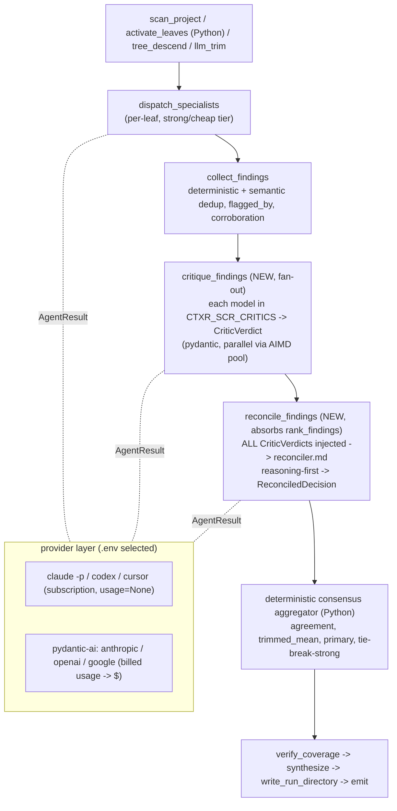
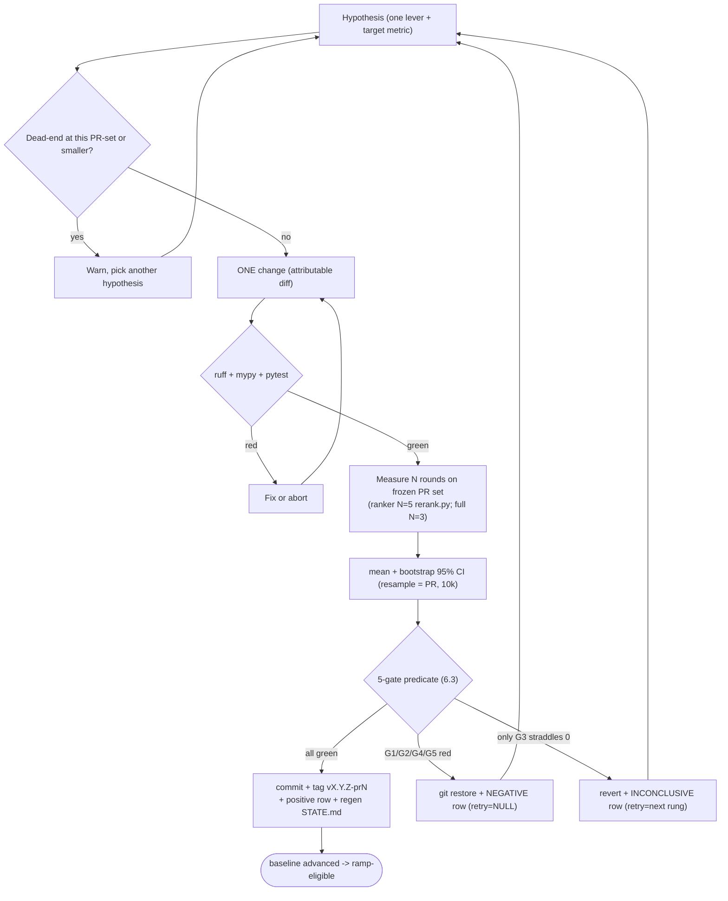
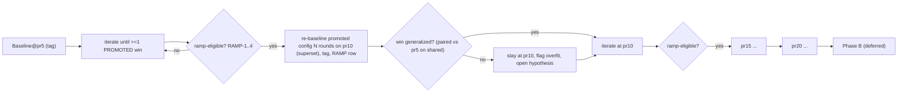
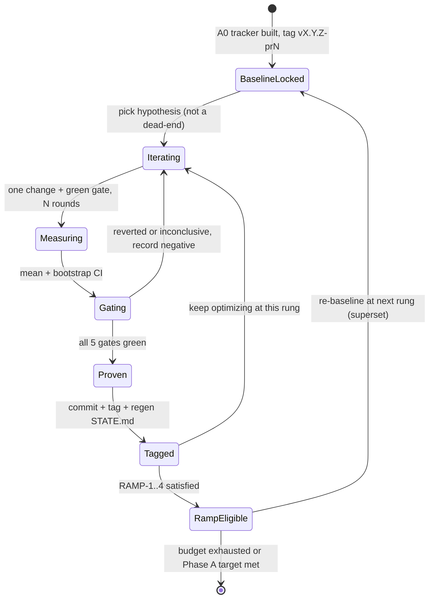

# skill-code-review: Master Plan to Top the Martian Code Review Bench

Status: PLANNING (canonical, checkbox-tracked). This file is the single source of truth for
the benchmark-optimization program. On approval, its FIRST execution step copies this content
to `skill-code-review/docs/plans/beating-competitors.md` (the in-repo canonical doc) and keeps
the two in lockstep.

---

## 0. HOW TO USE AND RESUME THIS DOCUMENT (read this first)

This plan is written to be continued cold from any new dialog after a context reset. If you
are resuming:

1. Read this file top to bottom once. It contains every locked decision, the methodology, the
   architecture, the schemas, the gate predicates, the phase checklist, the file anchors, the
   deps, and the verification commands.
2. Find "where we are" from the **generated state surface**, never from memory:
   - `skill-code-review/benchmarks/STATE.md` (generated; the live "YOU ARE HERE").
   - `uv run python benchmarks/experiments.py status` (one-line current position).
   - The phase checkboxes in section 9 of this file.
3. Read the ground-truth skill `skill-code-review/.agents/skills/scr-benchmark-optimizer/SKILL.md`
   (the measure-judge-diagnose-improve loop, the levers, the no-regression gate, the hard-won
   lessons) and `tmp/OBSERVATIONS.md` (what has already been tried).
4. Never skip the gate. Every change is proven by the 5-gate predicate (section 6.3) over N
   rounds before it is promoted and tagged. The PR count only grows after a proven, tagged win
   (section 6.6).
5. House rules that always apply: no em or en dashes in authored text; prompts live in
   `code_review/workers/*.md` (never hardcoded in Python); mutating scripts dry-run unless
   `--apply`; `ruff` + `mypy` + `pytest` green before any commit; reviewers.wiki SET or
   STRUCTURE changes stay human-gated; drive reviews only through the product runner.

---

## 1. CONTEXT (why this exists)

We want `skill-code-review` to be measurably #1 (or clearly top-tier) on Martian's open
**offline-50** code-review benchmark, then earn a durable, statistically defensible product
claim. A three-agent investigation (code reality, harness and optimization history, external
competitive reality) plus three design agents (methodology, architecture, calibration and
stats) produced this plan.

The reality anchor: **we have never run our own full 50.** Every self-measured number we own is
the 5-PR pilot, which our own benchmark skill flags as a cubic-favorable slice. The "0.62 bar"
is the competitors' number read off the committed Martian evals, not ours. Our full-50 F1 is
unknown, and we reach it gradually (5, 10, 15, 20 ...), never in one budget-busting run.

The user's stated fear, which the methodology in section 6 exists to kill: "we will do too
much in one round, then start running on a big amount of PRs and get lost somewhere in the
middle without knowing where we are or what to do next... move forward to more PRs only with
proof that our enhancements actually made it better, so we do not dig into a rabbit hole and
then into chaos development."

---

## 2. LOCKED DECISIONS (the grilled decision tree)

| Branch | Decision |
|---|---|
| Goal | Both, sequenced. Phase A tops the offline board with lean programmatic rigor; Phase B (the durable statistical product claim) is deferred behind an explicit go/no-go. |
| PR ramp | Gradual and budget-bound: lock a baseline at 5 PRs, then 10, 15, 20 ... Each rung is re-baselined and tagged. Never the full 50 in one run. |
| Tracker | A committed SQLite DB (`benchmarks/experiments.db`) plus a query CLI, with an auto-generated markdown view (`benchmarks/HISTORY.md`, `LEADERBOARD.md`, `STATE.md`) so a `git diff` still shows the leaderboard in plain text. Records config, PR set, metrics with bootstrap CIs, fp/PR, and dollars/review. `vX.Y.Z`-style tags freeze references. |
| Baseline and noise | The 5-PR signal is noise-bound (ranker is stochastic, F1 swings +/-0.05 to 0.10). Lock the baseline as the mean of N rounds with a bootstrap CI, re-judge the baseline under the identical rubric (paired), and require every change to clear the baseline CI, not its point estimate. |
| Provider layer | Use existing libraries: **PydanticAI** behind the existing `AgentRun` seam, backend and model selected by `.env` (python-dotenv), so CLI vs API vs provider are head-to-head comparable. Capture billed usage to dollars. Add the missing Gemini backend. Pin model snapshots. No OpenRouter. |
| Primary lever | A finding-level **verification/critic pass + reasoning-first** (reasoning ordered before the verdict), after diagnosing why the product runner under-realizes the offline-harness precision it already proves achievable. |
| Multi-model (hard requirement) | All critics and all models produce **pydantic-typed** outputs, and **all model outputs are always injected into the reconciliation prompt** (consensus raises confidence and determinism). Multi-model is core and always-on by design, not a cost-gated afterthought. The number of PRs (not disabling consensus) is the cost throttle while developing. |
| Calibration (hard requirement) | The confidence/threshold calibration is a durable, re-runnable, idempotent `scripts/calibrate.py` that fits with scikit-learn, persists a versioned artifact, and the product consumes the artifact at review time. Safe to run periodically as labels accumulate. |
| Stats | Programmatic-only now: bootstrap CIs, paired McNemar and permutation tests, cost tracking, multiple-comparison discipline, a contamination caveat. Defer the 200+ PR multi-rater internal set, Krippendorff ordinal alpha, and formal splits to Phase B. |

---

## 3. CORRECTED COMPETITIVE FACTS (fix these in the canonical doc)

- The **online track is live and Martian-ranked today**, not "post-launch aspirational." The
  offline-50 is the self-runnable track; the online track is real and operational (Martian v0
  post). Read the live (JavaScript-rendered) board for the current #1.
- The **verification/merge pass is Qodo's architecture, not cubic's.** cubic's credited levers
  are micro-agents + reasoning-first + toolset minimization (51% fewer false positives). Do not
  mis-attribute.
- The **current bar is ~0.64** (Qodo Extended, offline, Mar 15 snapshot, F1 0.643), not 0.62
  (cubic 0.618, Mar 25). These are vendor self-published snapshots drifting +0.02 to 0.03 per
  monthly refresh. Martian's stated recall ceiling: "no tool found more than 63% of known
  issues."
- The **judge is a 3-model panel** (Claude Opus 4.5, Claude Sonnet 4.5, GPT-5.2), not one
  pinned judge.
- **Gold-set bias and contamination:** the offline gold set was seeded from Augment/Greptile
  data, so a real bug outside the gold set scores as a false positive, and the 5 public repos
  may be memorized by the models. Treat the offline number as comparative, not absolute. Phase
  B's private set is what neutralizes this.

References: Martian benchmark (codereview.withmartian.com, github.com/withmartian/code-review-benchmark, MIT),
Martian v0 post (withmartian.com/post/code-review-bench-v0), cubic (cubic.dev/blog/learnings-from-building-ai-agents),
Qodo (qodo.ai/blog/qodo-ranked-1-ai-code-review-tool-in-martians-code-review-benchmark), PydanticAI (ai.pydantic.dev).

---

## 4. WHAT ALREADY EXISTS (do NOT rebuild) with anchors

- **FSM + in-process adaptive (AIMD) ThreadPoolExecutor runner**: `code_review/runner.py`
  (`run_review`, `_AdaptiveLimiter`, `RunnerStats`); 19-state spec `code_review/spec.py`
  (`build_spec`); agent-agnostic CLI `code_review/cli.py`.
- **Backend seam**: `AgentRun = Callable[[str,str,str], str]` at `dispatch.py:29`; `BACKENDS`
  registry `dispatch.py:149` (subprocess `claude -p`, `codex exec`, `cursor-agent`, plus a
  hand-rolled `_api_run` for anthropic/openai with undeclared deps and no Gemini); tier map
  strong/cheap to opus/sonnet `dispatch.py:69`; `make_dispatchers` `dispatch.py:298`.
- **Two-stage dedup + neutral re-rank**: deterministic key + semantic merge in
  `collect_findings` (`handlers.py`, `_semantic_merge`, `flagged_by`, `corroboration`); LLM
  re-judge `rank_findings` (`spec.py:1217`, prompt `workers/finding-ranker.md`); per-index
  re-attach in `_apply_rank_decisions` (`dispatch.py:239`) with primary threshold default 0.75
  (`dispatch.py:250`) and `_SEV_DEFAULT_CONF` (`dispatch.py:232`).
- **Structural verifier panel** (votes pass/reject on a worker's output SCHEMA, not per
  finding): `code_review/verifier_handler.py`, `_verifier_for` `spec.py:181`.
- **Deterministic navigation is already done** (the original plan's Phase 1 is solved):
  `activate_leaves` is pure Python (`handlers.py`); `tree_descend` and `llm_trim` are single
  metadata-only LLM passes with file-reading explicitly forbidden (`workers/tree-descender.md`,
  `workers/trim-candidates.md`); the slow agentic tree-walk was removed in commit `f51d136`.
  Embedding/dense-retrieval routing was tried and rejected (OBSERVATIONS #44: missed every
  `sec-*` leaf, a code patch is out-of-distribution as a retrieval query).
- **Corpus**: 24 `lang-*` and 27 `fw-*` reviewer leaves plus security/footgun/db leaves;
  coverage-gap analysis already run and 3 generalized footgun leaves promoted.
- **Harness**: `scripts/score.py` (micro-averaged recall/precision/F1 + fp/PR, point estimates,
  no CIs), `scripts/build_judge_input_prod.py`, `scripts/rerank.py` (cheap ranker-only re-run,
  ~1 call/PR), `scripts/setup_repo.py` (merge-base diff, never `baseRefOid..head`),
  `scripts/paths.py` (run-id + pr-shard layout). All run data is gitignored under `tmp/`.
- **Outputs are JSON-Schema dicts** validated by `ResponseSchema.model_validate` (`spec.py`).
  There are ZERO pydantic BaseModel classes in `code_review/` today. The specialist schema
  declares `confidence`, `tokens_in/out`, `runtime_ms` as LLM-self-reported (`spec.py:602-624`);
  billed usage is discarded.

---

## 5. ARCHITECTURE: multi-model, pydantic-typed, PydanticAI behind the seam

Recommendation: **typed-boundary-only, not a full migration.** The FSM engine and the 9 inline
handlers stay dict-native; we type the specialist/critic/reconcile boundaries and generate the
engine-side JSON-Schemas from the pydantic models so they cannot drift.

### 5.1 Provider layer (PydanticAI as a backend, not a rewrite)

Keep `AgentRun` as the universal seam. Widen the return so usage stops being discarded:

```python
# code_review/dispatch.py (new)
@dataclass(frozen=True)
class AgentResult:
    text: str                          # back-compat: str(result) == old return
    usage: BilledUsage | None = None   # from PydanticAI result.usage(); None for CLI subprocess
    model_id: str | None = None        # pinned snapshot actually used
    raw: dict | None = None            # parsed structured payload when produced natively

AgentRun     = Callable[[str, str, str], str]          # unchanged; CLI backends keep it
AgentRunRich = Callable[[str, str, str], AgentResult]  # new; PydanticAI + adapted CLI backends
```

- `make_dispatchers` (`dispatch.py:298`) accepts either; a plain `AgentRun` is wrapped to
  `AgentResult(text=run(...), usage=None)`. Every existing backend is untouched.
- New `pydantic-ai` backend (one `BACKENDS` entry, model chosen by `.env`) covers Anthropic,
  OpenAI, and Google (Gemini) under one provider matrix, replacing the hand-rolled `_api_run`.
  Usage comes from `result.usage()`.
- CLI backends (`claude`, `codex`, `cursor`) stay subprocess (the $200 subscription path,
  `usage=None`).
- **Both paths yield the same pydantic objects**: CLI text is parsed then
  `SpecialistOutput.model_validate(...)`; the PydanticAI path uses `Agent(model,
  output_type=SpecialistOutput)` so the provider enforces the schema server-side. The runner and
  FSM still see `.model_dump()` dicts, exactly as today.

### 5.2 The pydantic model hierarchy (`code_review/models.py`, NEW)

```python
class BilledUsage(BaseModel):           # runner-populated, NOT LLM-self-reported
    input_tokens: int = 0; output_tokens: int = 0; requests: int = 1
    model_id: str | None = None; cost_usd: float | None = None

class Observed(BaseModel):              # observability mixin
    usage: BilledUsage | None = None; wall_ms: int | None = None; backend: str | None = None

class Finding(BaseModel):
    severity: Severity                  # reuse the existing StrEnum at spec.py:78
    file: str; line: int | None = None
    title: str; description: str | None = None; impact: str | None = None; fix: str | None = None
    confidence: float | None = Field(None, ge=0, le=1)   # specialist self-conf (biased)
    verified_via: list[str] = Field(default_factory=list)

class SpecialistOutput(Observed):
    id: str; status: str = "completed"
    findings: list[Finding] = Field(default_factory=list); skip_reason: str | None = None

# multi-model critic layer
class CriticFindingVote(BaseModel):
    i: int                               # finding index (same compact indexing as the ranker)
    is_defect: bool; defect_confidence: float = Field(ge=0, le=1); primary: bool
    is_duplicate_of: int | None = None; rationale: str = Field("", max_length=280)

class CriticVerdict(Observed):
    critic_id: str                       # e.g. "anthropic:claude-opus-4-8-20260514"
    votes: list[CriticFindingVote]

class ReconciledFinding(Finding):
    agreement: float = Field(ge=0, le=1) # fraction of critics calling it a defect
    critic_count: int; defect_confidence: float = Field(ge=0, le=1); primary: bool
    flagged_by: list[str] = Field(default_factory=list)   # leaves (existing)
    agreed_by: list[str] = Field(default_factory=list); dissent: list[str] = Field(default_factory=list)

class ReconciledDecision(Observed):
    findings: list[ReconciledFinding]; severity_counts: dict[str, int]
    consensus_method: str; total_cost_usd: float | None = None
```

The `spec.py` schema builders become `ResponseSchema.model_validate({"schema":
SpecialistOutput.model_json_schema()})` etc., so the engine-side guard is generated from the
models (single source of truth). `handlers.py` stays dict-native (`model_dump`).

### 5.3 The always-on multi-model reconciliation stage (the hard requirement, made literal)

Two new FSM states inserted between `collect_findings` (`spec.py:1202`) and the old
`rank_findings` (`spec.py:1217`):

1. **`critique_findings`** (fan-out worker state): for each model in `CTXR_SCR_CRITICS`,
   dispatch the same compact indexed finding list the ranker already builds, with
   `workers/finding-critic.md`, output-typed to `CriticVerdict`. N models run in parallel
   through the existing AIMD pool. Every configured model always runs.
2. **`reconcile_findings`** (worker state; absorbs `rank_findings`): a single reconciliation
   call gets ALL N `CriticVerdict`s injected into its prompt (`workers/reconciler.md`), with
   reasoning ordered before the verdict, and emits a typed `ReconciledDecision`.

`rank_findings` is kept as the N=1 degenerate case (set `CTXR_SCR_CRITICS` to one model) so the
old behavior is recoverable via `.env`. The structural `verifier_handler.py` is unchanged (it
answers a different question: output-schema validity, not per-finding correctness).

### 5.4 Consensus aggregation (deterministic Python, in a new handler)

The reconciler LLM explains; the aggregation is reproducible arithmetic over the votes:

- `agreement = (#critics with is_defect) / critic_count`.
- `defect_confidence = trimmed_mean(critic confidences)` (drop highest and lowest when N>=4).
- `primary = (agreement >= tau_agree) and (defect_confidence >= primary_threshold)`, default
  `tau_agree = 0.5`, tunable via `.env`; unanimous agreement is the high-confidence core.
- Tie-break (even N, 50/50): defer to the strong-tier critic's vote, recorded as
  `consensus_method = "tie-break-strong"`.
- `dissent[]` records disagreeing models (audit trail; feeds optimizer analysis).

This raises confidence (a finding three independent models flag is far less likely to be a
hallucination) and determinism (the final gate is deterministic over the votes; consensus
smooths per-model sampling noise).

### 5.5 Determinism, stated honestly

Deterministic (we control): pinned model snapshots in `.env` (not floating aliases like
`opus`); structured-output enforcement; `temperature=0` plus `seed` where the provider supports
it (OpenAI seed; Anthropic and Google honor `temperature=0` but expose no seed); the consensus
aggregation; index-based re-attachment (text never regenerated). NOT deterministic: LLM sampling
is not bit-reproducible even at `temperature=0`; the CLI path (`claude -p`) is the least
deterministic and yields no billed usage. The honest claim: the API + pinned-snapshot +
consensus path is the determinism story; the CLI path is the cost-free comparison arm.

### 5.6 Cost reality (do not pretend it is free)

Always-on N critics multiply the reconciliation cost by ~N, but the critic inputs are small
(compact votes over an already-deduped list), so the marginal multiplier on total review cost is
modest. It is real and must be measured, not assumed. Make cost first-class: add
`BilledUsage`/`cost_usd` to `RunnerStats` (`runner.py:58`), sum every `AgentResult.usage`, use a
static per-model price table in `code_review/config.py`, surface `total_cost_usd` on `RunResult`
and print dollars/review in `cli.py`. The budget throttle while developing is the PR count, not
disabling consensus. The CLI/subscription arm runs the same multi-critic logic at zero marginal
API cost, so the tracker shows CLI and API side by side.

### 5.7 Architecture data-flow (mermaid)



---

## 6. THE DEVELOPMENT METHODOLOGY (the anti-chaos engine)

Built on top of `scr-benchmark-optimizer`'s measure-judge-diagnose-improve loop. Three locks:
one change per round, proof-before-scale, a never-stale state surface.

### 6.1 Vocabulary

- **PR set**: the frozen ordered list of benchmark PRs at the current rung (`pr5`, `pr10`, ...),
  always a SUPERSET as it grows.
- **Baseline**: the current best proven, tagged config at the current PR set; a git tag
  `vX.Y.Z-<pr_set_id>` plus a row in `experiments.db`.
- **Round**: one product run over the entire current PR set, judged and scored, producing one
  `(recall, precision, F1, fp/PR, $/review)` point. One round == one `run_id`.
- **Measurement**: N rounds of the same config on the same PR set, reduced to mean + bootstrap
  95% CI per metric. The atomic unit of evidence. Bootstrap resample unit = the PR.
- **Iteration**: hypothesis, one change, measurement, gate, promote-or-revert. The atomic unit
  of development.
- **Ramp**: increasing the PR set to the next rung; allowed only after a proven, tagged win.

### 6.2 The iteration loop and N

```
HYPOTHESIS (falsifiable, names ONE lever and the metric it should move)
  -> tracker check: is this a known dead-end at this PR-set or smaller? if so, warn and pick another
  -> ONE change (single lever, attributable diff)
  -> GREEN GATE: ruff + mypy + pytest (must pass before a benchmark dollar is spent)
  -> MEASURE: N rounds on the FROZEN current PR set (same backend, same judge model)
  -> reduce to mean + bootstrap 95% CI per metric
  -> PROVE: the 5-gate predicate (6.3)
       PASS -> commit + tag vX.Y.Z-<pr_set_id> + positive experiment row + regenerate STATE.md
       FAIL -> git restore + NEGATIVE row (dead_ends, with retry_at_pr_set)
```

N by change class: ranker-only (via `rerank.py`, ~1 call/PR, cheap) **N=5**;
specialist/routing/prompt or corpus or infra (full product re-run) **N=3** (the skill's floor).

### 6.3 The 5-gate PROMOTE predicate (EXACT)

Let B = baseline measurement, C = candidate measurement (each N rounds). Paired bootstrap deltas
over PRs (10,000 resamples). Promote iff ALL hold:

```
GATE-1 RECALL non-regression:  mean(recall_C) >= mean(recall_B)
                               AND lower-95%-CI(recall_C - recall_B) >= -0.03
GATE-2 NOISE non-regression:   mean(fp_per_pr_C) <= mean(fp_per_pr_B)
                               AND upper-95%-CI(fp_per_pr_C - fp_per_pr_B) <= +0.30
GATE-3 PROGRESS (the teeth):   lower-95%-CI(F1_C - F1_B) > 0   (paired ΔF1 CI strictly excludes 0)
GATE-4 STABILITY:              stdev(F1_C over N) <= stdev(F1_B) + 0.02
GATE-5 COST guard:             mean($/review_C) <= 1.25 * mean($/review_B)
```

GATE-1 + GATE-2 are the existing both-axes no-regression gate, now CI-aware. GATE-3 is the new
requirement: a win must be CI-separated from the baseline, not a lucky round. GATE-4 and GATE-5
stop erratic configs and cost blowups. Outcomes: all green -> PROMOTE; GATE-1/2/4/5 red ->
REVERT (genuine regression, `retry_at_pr_set = NULL`); only GATE-3 straddles zero -> INCONCLUSIVE
(revert, `retry_at_pr_set = next rung`, the CI may separate at more PRs).

Statistics behind the predicate: bootstrap CIs are per-PR resampling (numpy, 10k); paired tests
are McNemar exact (`statsmodels.stats.contingency_tables.mcnemar`, recall axis on shared goldens)
and a paired permutation test on ΔF1 (`scipy.stats.permutation_test`, `permutation_type="samples"`).
Below ~12 PRs the predicate returns `inconclusive` rather than `promote` (underpowered).

### 6.4 Single-change discipline (the anti "too much" lock)

One lever per iteration (ranker OR specialist OR routing OR one threshold, never two). A change
must be attributable to one diff; the tracker stores `git diff --stat` and warns (requiring an
explicit `--force-multi` with a written reason) when more than one logical lever changed. No
"while I am here" bundling. The PR set is frozen during an iteration (ramp is a separate gated
step). Green before measure.

### 6.5 Dead-ends ledger (never repeat a rabbit hole)

Every measurement, pass or fail, writes a row. A `dead_ends` table keys on
`hypothesis_hash = sha256(normalized hypothesis + lever)` with `why_failed` (which gate) and
`retry_at_pr_set`. Before starting an iteration, `experiments.py check <hypothesis> <lever>`
warns loudly if a matching dead-end exists at the current or smaller PR set. Mirror one-line
summaries into `tmp/OBSERVATIONS.md` and (optionally) the shared RAG memory via `save_lesson` so
other sessions inherit the dead-ends.

### 6.6 Proof-before-scale ramp gate and rollback

Ramp from rung k to k+1 iff ALL hold: RAMP-1 at least one PROMOTED win banked at rung k; RAMP-2
HEAD == the rung-k tag, tree clean; RAMP-3 the promoted baseline's `f1_stdev <= 0.06`; RAMP-4
projected N-round cost at k+1 within remaining budget. Ramping is NOT an iteration: it freezes
the new superset PR set, runs the current promoted config N rounds to form `Baseline@(k+1)`, tags
it (`-pr<k+1>` suffix only), and records a `RAMP` row. Rollback rule: ramping never rolls the PR
set backward (more PRs is always more honest). If a win fails to generalize at k+1 (paired
comparison on the shared subset regresses), stay at k+1, flag `regression_on_ramp`, and open an
"overfit the rung-k slice" hypothesis. Code changes roll back on a regression; the PR set never
does.

### 6.7 The "YOU ARE HERE" state surface

`benchmarks/STATE.md` is GENERATED by `experiments.py state` from the DB (never hand-edited, same
discipline as the generated wiki). It shows: current PR set and rung, baseline tag and HEAD-clean
flag, baseline F1 with CI, recall, fp/PR, dollars/review, stability, last proven win, open
hypotheses (cheapest-proven-win-first), dead-ends, and the single next action.
`experiments.py status` prints the one-liner. We deliberately do NOT use the ctxr-fsm substrate to
drive this loop in Phase A (its per-state `allowed_tools` constraint and deterministic
output-schema verifier fight an exploratory, statistically-gated loop; the DB is the durable
state). A `bench-iteration` FSM wrapper is a Phase-B option for tamper-evident unattended runs.

### 6.8 Methodology mermaid

Single-iteration gated loop:



Proof-before-scale ramp ladder:



State diagram:



---

## 7. CALIBRATION AND STATISTICS

### 7.1 Critical prerequisite (must ship in A0): the per-finding label does not exist yet

`build_judge_input_prod.py` emits skill candidates as bare text and drops `defect_confidence`;
judge verdicts record only aggregate `tp/fp/fn` plus `matched_golden`. So the
`(defect_confidence -> matched boolean)` signal the calibrator needs is thrown away at the judge
boundary. Fix first:
- `build_judge_input_prod.py`: emit each skill candidate as `{"text", "defect_confidence",
  "severity", "idx"}`.
- The judge verdict for skill tools records per-candidate `matched: [idx...]`, so
  `correct = idx in matched`.
- `scripts/ingest_verdicts.py` writes one row per finding into the DB `findings` table:
  `(run_id, pr_id, tool, finding_idx, defect_confidence, severity, matched, golden_count)`. The
  DB only grows; this is the calibrator's sole input.

### 7.2 `scripts/calibrate.py` (re-runnable, idempotent, dry-run by default)

- Input: the DB `findings` table for skill tools, optional `--since` / `--runs`.
- Fit with scikit-learn: `IsotonicRegression(out_of_bounds="clip")` and Platt
  (`LogisticRegression`), cross-validated with `GroupKFold(groups=pr_id)` (PR-grouped so
  within-PR correlation does not leak); `--method auto` picks the lower out-of-fold Brier.
- Threshold: pool out-of-fold calibrated probabilities and labels, `precision_recall_curve`,
  pick the F1-maximizer; map back to a raw `defect_confidence` cut.
- Quality: Brier and ECE before vs after on the held-out PRs (ECE is a ~15-line numpy helper
  over `sklearn.calibration.calibration_curve` bins, unit-tested). A re-run that does not improve
  held-out Brier+ECE refuses to overwrite `current.json` unless `--force`.
- Artifact `benchmarks/calibration/<tag-or-date>.json` plus a stable copy `current.json`:
  serialized curve (isotonic `x/y` knots, or sigmoid `a/b`), `primary_threshold`, `git_sha`,
  `n_samples`, `n_prs`, `groups_holdout`, before/after metrics, `cold_start`. The product evals
  the curve in pure Python, so it never imports sklearn at review time.
- Cold-start staging by sample count: below the floor (default 200 findings or ~8 PRs) do not fit
  isotonic; either emit no artifact (product keeps 0.75, zero regression) or fit only the
  2-parameter Platt clamped to `[0.6, 0.85]`; even thinner, fall back to per-severity empirical
  positive-rates (a data-driven `_SEV_DEFAULT_CONF`). As PRs accumulate the same script
  auto-upgrades to isotonic, no code change.

Product consumer: `code_review/calibration.py` loader (no heavy deps) reads `current.json`;
`_apply_rank_decisions` (`dispatch.py:264-268`) applies `cal.apply(conf)` and sources the
threshold from the artifact, with the literal 0.75 kept as the no-artifact fallback.

### 7.3 `scripts/stats.py` consumed by `score.py`

- Bootstrap CIs: per-PR resampling (numpy, B=10,000) for recall/precision/F1; report `point [lo,
  hi]`.
- Paired comparison vs a named baseline: McNemar exact (statsmodels) on shared goldens;
  permutation test on ΔF1 (scipy, paired). The promote predicate is section 6.3.
- Multiple-comparison control (lightweight): hold the test set out (decide on a frozen held-out
  PR slice ablations never touch), report effect + CI as primary with p secondary, one
  pre-registered headline metric (F1), and Benjamini-Hochberg FDR
  (`statsmodels.stats.multitest.multipletests(method="fdr_bh")`) when many variants are compared
  in one report. No heavier control.

### 7.4 Dependencies (dev-only; runtime package gains ZERO new runtime deps)

Add under a dev/bench extra in `pyproject.toml`, each annotated: `scikit-learn` (isotonic/Platt,
GroupKFold, PR-curve, Brier, calibration_curve), `scipy` (paired permutation), `statsmodels`
(exact McNemar, BH-FDR), `numpy` (bootstrap, ECE). Runtime adds only `pydantic-ai-slim[anthropic,openai,google]`
and `python-dotenv` (section 5). The product reads a JSON artifact and does piecewise-linear or
sigmoid arithmetic; sklearn stays in `scripts/`.

---

## 8. THE EXPERIMENT TRACKER (`benchmarks/`, tracked)

SQLite DB `benchmarks/experiments.db` plus `benchmarks/experiments.py` CLI. Tracked (committed),
so a tag reconstructs the full history. Tables:

- `experiments(run_id, ts, git_sha, pr_set_id, baseline_tag, backend, config_json, lever,
  hypothesis, diff_stat, n_rounds, recall_mean, recall_ci_lo, recall_ci_hi, precision_mean,
  f1_mean, f1_ci_lo, f1_ci_hi, fp_per_pr_mean, cost_mean, f1_stdev, verdict, gate_detail_json,
  calibration_tag, notes)`.
- `metrics(run_id, tool, recall, precision, f1, tp, fp, fn, fp_per_pr, ci_low, ci_high, usd_per_review)`.
- `findings(run_id, pr_id, tool, finding_idx, defect_confidence, severity, matched, golden_count)`.
- `dead_ends(hypothesis_hash, lever, pr_set_id, summary, why_failed, retry_at_pr_set)`.

CLI subcommands: `record` (ingest a score.py run + config + git SHA + $/review), `ci`,
`gate --baseline <run>` (apply the 5-gate predicate), `compare <a> <b>`, `history`, `leaderboard`,
`state` (regenerate STATE.md), `status` (one-liner), `check <hypothesis> <lever>` (dead-end
guard). Generated markdown views: `benchmarks/HISTORY.md`, `LEADERBOARD.md`, `STATE.md`.

Tag convention: `vX.Y.Z-<pr_set_id>` (for example `v0.4.0-pr10`). The `-pr<N>` suffix advances on
ramp (same code, new substrate); the semantic `X.Y.Z` advances on a promoted code change. The DB
row, the calibration tag in force, and the git SHA together make any result reproducible.

---

## 9. PHASE PLAN (the live checkbox tracker)

Each phase is one or a few gated iterations, sequenced by dependency and cheapest-proven-win
first. Each ends green (`ruff` + `mypy` + `pytest`), records a tracked experiment, and (for
optimization phases) clears the 5-gate predicate. Mark boxes as work lands.

### A0. The proof machine (foundation; gates everything)
- [ ] `benchmarks/experiments.db` + `benchmarks/experiments.py` CLI (all subcommands in section 8).
- [ ] `scripts/stats.py` + `score.py --ci --baseline`: bootstrap CIs, McNemar, permutation, the
      5-gate predicate.
- [ ] Per-finding label prerequisite (7.1): `build_judge_input_prod.py` carries
      `defect_confidence/severity/idx`; verdicts record per-candidate `matched`;
      `scripts/ingest_verdicts.py` populates the `findings` table.
- [ ] `experiments.py state/status` generates `benchmarks/STATE.md` and the one-liner; dead-ends
      ledger live.
- [ ] `scripts/paths.py`: add the tracked `benchmarks/` layout (DB, calibration) next to the tmp
      sharding helpers.
- [ ] Self-test gate: re-score a committed run and reproduce its F1 within float tolerance;
      bootstrap CI coverage correct on synthetic data. (No optimization yet.)

### A1. Lock Baseline@pr5
- [ ] Run the 5 pilot PRs (cal.com-14943, discourse-1, grafana-80329, keycloak-32918,
      sentry-67876) N=3 rounds on the current `claude -p` backend; paired re-judge under the
      identical rubric; record mean + CI; tag `v-bench-0.1.0-pr5`; regenerate STATE.md.
- [ ] Gate: baseline reproducible within its CI across the 3 rounds.

### A2. Calibration (cheapest proven win; rerank.py, N=5)
- [ ] `scripts/calibrate.py` (7.2) + `code_review/calibration.py` loader + the surgical
      `_apply_rank_decisions` change (artifact-or-0.75 fallback).
- [ ] First banked win: fit calibration on accumulated labels, prove via the 5-gate predicate that
      the product moves up toward the offline-harness frontier it already proves achievable.
- [ ] Gate + tag the win; record the calibration tag in force on the experiment row.

### A3. Provider / pydantic / observability layer (parity-gated, semantically neutral)
- [ ] Add deps (`pydantic-ai-slim[anthropic,openai,google]`, `python-dotenv`); `code_review/config.py`
      (load_dotenv, price table, critic roster); `.env` plumbing (section 11).
- [ ] `AgentResult`, the `pydantic-ai` backend (Gemini included), CLI-to-typed wrapper, billed
      usage to `RunnerStats`, dollars/review in `cli.py`. `code_review/models.py` typed boundary;
      generate `ResponseSchema` JSON-Schemas from the models.
- [ ] Parity gate: review outputs non-regressed (F1/recall/fp within CI) AND dollars/review now
      reconciles against billed usage; CLI vs API on the same PRs is a clean tracked comparison.

### A4. Always-on multi-model critic + reconcile stage (the primary lever)
- [ ] New states `critique_findings` (fan-out) and `reconcile_findings` (absorbs rank_findings);
      prompts `workers/finding-critic.md`, `workers/reconciler.md`, verifier
      `verifiers/reconcile_findings.md`; deterministic consensus aggregator handler; reasoning-first
      ordering. The stage is multi-model-always-on by design (roster from `.env`).
- [ ] Validate plumbing with N=1 critic (green gate + parity), then run the real measured
      experiment. Diagnose the product-vs-harness precision gap first.
- [ ] Gate via the 5-gate predicate (GATE-5 cost binding); measure the critic stage's own
      precision/recall separately (plan F19); tag the win.

### A5. Cross-model critics (Claude + GPT + Gemini), cost-watched
- [ ] Expand `CTXR_SCR_CRITICS` to the full roster; all verdicts injected into the reconciler;
      tune `tau_agree` and the trimmed-mean; record dollars/review.
- [ ] Gate: F1 clears the baseline CI AND the dollars/review increase is justified by the tracker
      curve; else keep the full roster as an optional premium tier, not the default.

### A-RAMP. PR ramp 5 -> 10 -> 15 -> 20 (interleaved, proof-before-scale)
- [ ] After each banked win at the current rung, ramp per section 6.6 (superset PRs via
      `setup_repo.py` merge-base diff), re-baseline, tag `-pr<N>`, let the tracker accumulate
      quality and cost history. Stop chasing the 5-PR pilot once 10+ PRs give a stable CI.

### Phase A target
- [ ] F1 on the frontier above the live board bar (~0.64), stable across rounds, at a ramped PR
      set, with recorded cost. Then evaluate the Phase B go/no-go.

### Phase B (DEFERRED, go/no-go): the durable product claim
- [ ] Private internal labeled set growing toward 200+ PRs, multi-rater with reconciliation.
- [ ] Krippendorff ordinal alpha for severity; train/dev/calibration/test splits with power
      analysis; program-wide multiple-comparison control; the locked test set read exactly once.
- [ ] Optional `bench-iteration` ctxr-fsm wrapper for tamper-evident unattended sweeps.

---

## 10. CUT OR RESCOPED FROM THE ORIGINAL EIGHT-PHASE PLAN

- Phase 1 deterministic router: CUT (already implemented; activation is Python, descent/trim are
  metadata-only). At most a small descent-cost micro-optimization later, not a phase.
- Embedding/dense-retrieval navigation: CUT (tried and rejected, regresses recall, OBSERVATIONS #44).
- PydanticAI: now IN (the user's reversal: use existing libraries). Introduced behind the
  `AgentRun` seam, typed-boundary-only, not a full engine rewrite.
- Full Logfire cost-tree / async span aggregation: DEFERRED; minimal billed-usage-to-dollars
  capture on every backend is enough now.
- 200-PR multi-rater set + Krippendorff + formal splits: DEFERRED to Phase B.
- Coverage-gap leaf authoring: DONE (3 leaves promoted); revisit only per a confirmed miss.

---

## 11. CRITICAL FILES, DEPS, AND .env REFERENCE

Critical files (edit):
- `code_review/dispatch.py`: `AgentRun`/`AgentResult` (`:29`), `BACKENDS` (`:149`),
  `make_dispatchers` (`:298`), `_apply_rank_decisions` (`:239`, `:264-268`), `_SEV_DEFAULT_CONF`
  (`:232`); add `pydantic_ai_run`, the CLI-to-typed wrapper, critic dispatch, calibration apply.
- `code_review/spec.py`: schema builders (`_specialist_schema` `:588`, rank schema `:1217`),
  `build_spec` state list (`:1470`); add `_critique_findings`, `_reconcile_findings`, regenerate
  schemas from `models.py`.
- `code_review/runner.py`: `RunnerStats` (`:58`), `_dispatch_units` (`:292`), `RunResult` (`:330`),
  `run_review` (`:375`); thread billed usage and cost; reuse the pool for the critic fan-out.
- `scripts/score.py` (CIs + `--baseline`), `scripts/build_judge_input_prod.py` (carry
  defect_confidence + idx), `scripts/paths.py` (tracked `benchmarks/` layout).
- `.agents/skills/scr-benchmark-optimizer/SKILL.md`: reconcile (CI-aware gate + GATE-3/4/5,
  lever-typed N, the tracked `benchmarks/` ledger, the "never stop the program, always revert the
  change" wording).

Critical files (new): `code_review/models.py`, `code_review/config.py`, `code_review/calibration.py`,
`code_review/workers/finding-critic.md`, `code_review/workers/reconciler.md`,
`code_review/verifiers/reconcile_findings.md`, `scripts/calibrate.py`, `scripts/stats.py`,
`scripts/ingest_verdicts.py`, `benchmarks/experiments.py`, `benchmarks/experiments.db`,
`benchmarks/{STATE,HISTORY,LEADERBOARD}.md`, `benchmarks/calibration/*.json`.

Runtime deps: `pydantic-ai-slim[anthropic,openai,google]`, `python-dotenv`. Dev/bench deps:
`scikit-learn`, `scipy`, `statsmodels`, `numpy`. Each annotated in `pyproject.toml`.

`.env` reference (read by `code_review/config.py` via python-dotenv):
```
CTXR_SCR_BACKEND=pydantic-ai            # or claude | codex | cursor
CTXR_SCR_MODEL_STRONG=anthropic:claude-opus-4-8-<snapshot>
CTXR_SCR_MODEL_CHEAP=anthropic:claude-sonnet-4-6-<snapshot>
CTXR_SCR_CRITICS=anthropic:claude-opus-4-8-<snap>,openai:gpt-5.2-<snap>,google-gla:gemini-3-pro-<snap>
CTXR_SCR_CRITIC_SETTINGS=temperature=0,seed=7
CTXR_SCR_TAU_AGREE=0.5
ANTHROPIC_API_KEY=...  OPENAI_API_KEY=...  GEMINI_API_KEY=...
```

---

## 12. VERIFICATION (end to end)

- Per phase: `uv run ruff check code_review/ tests/ && uv run mypy code_review/ && uv run pytest`.
- Tracker: `benchmarks/experiments.py record` a run, `gate --baseline <run>`, confirm
  STATE.md/HISTORY.md regenerate and the DB round-trips; a `vX.Y.Z-prN` tag's commit reconstructs
  history.
- Baseline: N-round run reproduces within its bootstrap CI; paired re-judge matches.
- Calibration: `scripts/calibrate.py` (dry-run) prints before/after Brier+ECE and the chosen
  threshold; `--apply` writes the artifact; the product loads it and the literal 0.75 remains the
  no-artifact fallback.
- Provider: an API-backed review records a correct dollars/review reconciled against provider
  usage; CLI vs API on the same PRs is a clean tracked comparison.
- Each lever: re-run on the current ramp set, judge consistently, the 5-gate predicate decides
  promote/revert; record + tag wins, revert losses, log dead-ends.
- Run the product (reference command from scr-benchmark-optimizer):
  `cd skill-code-review && export GITHUB_TOKEN="$(gh auth token)" &&
   uv run python -m code_review.cli review --repo tmp/repos/<ab>/<pr> --base <base_diff> --head <head>
   --run-dir tmp/runs/<run-id>/<ab>/<pr> --backend <env> --max-workers 8 --clean`.

---

## 13. POINTERS TO GROUND TRUTH (read when resuming)

- `skill-code-review/.agents/skills/scr-benchmark-optimizer/SKILL.md`: the loop, the levers (by
  symptom), the no-regression gate, the hard-won lessons, the honest current standing.
- `skill-code-review/tmp/OBSERVATIONS.md`: the ✅/🛠️/⏳/➖ status board of what has been tried
  (diff-base merge-base trap #8, judge wiring validated #11, semantic-dedup precision lever #23/#24,
  embedding routing rejected #44, full-50 deferred #59).
- `skill-code-review/tmp/results/PROD-REPORT.md`: the leaderboard and analysis.
- `skill-code-review/.agents/skills/scr-reviewers-wiki-authoring/SKILL.md` and
  `.agents/rules/docs-and-wiki-stewardship.md`: the human-gated corpus rules (still apply).
- `skill-code-review/scripts/`: the durable harness (`score.py`, `rerank.py`,
  `build_judge_input_prod.py`, `setup_repo.py`, `paths.py`).
